# Fleet Maintenance and Parts Management Platform: Product Requirements and System Design

## Research Basis and Product Direction

**Deliverable 1. Executive Summary**

The fleet should **not** adopt a general ERP, a full enterprise EAM suite, or an open-source logistics platform as the primary user interface for day-to-day maintenance. The strongest direction is a **purpose-designed fleet maintenance and parts application built as a modular monolith, using permissively licensed infrastructure and selectively adapting proven workflow patterns from existing systems**.

For an initial fleet of roughly 25 commercial trucks, the operationally complete core is smaller than ERPNext, Odoo, openMAINT, or Fleetbase, but materially deeper than a personal vehicle tracker such as LubeLogger. The product should center on six tightly connected operational concepts:

1. **Assets and meters**
2. **Inspections, defects, and maintenance requests**
3. **Preventive-maintenance plans and work orders**
4. **Parts inventory and purchasing**
5. **Asset history, costs, and audit records**
6. **Optional telematics ingestion feeding human-reviewable maintenance alerts**

The system should remain fully functional without AutoPi or any other telematics source. Telematics should reduce typing and improve detection, not become a dependency for opening work orders, entering mileage, issuing parts, completing inspections, or returning equipment to service.

This recommendation is supported by several complementary open-source projects. LubeLogger demonstrates unusually low-friction vehicle-centric records, mobile-oriented presentation, QR deep links, reminders, odometer workflows, inspections, APIs, webhooks, attachments, and mobile card layouts without adopting ERP terminology. Its current v1.7.1 release was published August 19, 2026, and its source is MIT licensed. citeturn8view1turn25search0 InvenTree provides the strongest shortlisted parts-management reference, including stock locations, available versus allocated stock, supplier parts, purchase orders, stocktake functionality, serialized/batch items, REST APIs, barcode workflows, and a Flutter mobile application; its current 1.5.2 release was published August 25, 2026, under MIT. citeturn14search0turn13search2turn13search11turn13search14turn21search2

ERPNext provides stronger purchasing, warehouse, reorder, material-request, stock-ledger, and receiving concepts than its vehicle-maintenance functionality warrants using the ERP itself as the fleet application. Its current release line is v16, with v16.33.0 published August 25, 2026; the project is GPLv3. citeturn19search0turn3search12turn3search18turn1search0 openMAINT demonstrates mature EAM concepts such as asset hierarchy, corrective maintenance processes, document registers, maintenance costs, labor/material association, and maintenance-service workflows, but it brings substantially more facility/EAM abstraction than this fleet needs and is AGPL-licensed with project-specific attribution conditions. citeturn4search6turn4search23turn4search11

Fleetbase is the closest active open-source project found to the desired combination of vehicles, maintenance schedules, work orders, parts, devices, telematics, APIs, and operational events. It is also a much broader logistics platform whose dispatch, commerce, order-management, and related abstractions exceed the defined product boundary; the public code is AGPL. Its August 2026 releases demonstrate very active development. citeturn15search0turn15search5turn15search7turn20search0 Traccar supplies a better reference for a discrete telematics subsystem: self-hosting, device/protocol abstraction, REST APIs, WebSockets, positions/events, and an Apache-2.0 license. Its latest verified release is v6.15.3, published August 26, 2026. citeturn12search6turn12search1turn19search2

AutoPi is technically compatible with this architecture because its current documentation exposes REST APIs, MQTT-related integration mechanisms, webhooks, CAN/J1939/OBD-II collection, custom edge containers, and device-side/local data capabilities. AutoPi documents a direct "own server" data path for specified current products, including TMU CM4 and CAN-FD Pro, which is particularly important for preventing the fleet application from becoming dependent on a proprietary cloud path. AutoPi Core itself is Apache-2.0 licensed. citeturn6search0turn6search4turn6search8turn19search3

The principal architecture recommendation is therefore:

> **Build the fleet application around a PostgreSQL-backed modular monolith with a responsive offline-capable field client, a clean REST API, an immutable inventory/meter/audit history model, an asynchronous integration boundary, and a telematics ingestion pipeline that treats AutoPi as one replaceable adapter rather than as the source of truth for maintenance.**

Microservices are not justified at the initial fleet size. A modular monolith provides transactional consistency for work orders, inventory, purchasing, meters, and audit history while still allowing the telematics ingest worker, notification delivery, file storage, or reporting workload to be extracted later.

**What the fleet actually needs:** authoritative asset history, PM scheduling, defects/requests, technician work execution, safety status, inventory, purchasing/receiving, auditable costs, reliable offline field operation, and optional trustworthy automated meter/condition input.

**What it does not need:** native general ledger, accounts payable, payroll, dispatch, customer order management, CRM, manufacturing, an ELD subsystem, route planning, or automatic work-order creation from every diagnostic fault.

**Minimum operationally complete MVP:** assets, meters, PM schedules, reusable service packages, driver inspections/defects, maintenance requests, work orders/tasks, technician execution, asset availability, part master, warehouses/bins, stock transactions, reservations/issues/returns, vendors, basic purchase orders and partial receiving, attachments, RBAC, audit history, CSV import/export, essential reports, REST API, AutoPi meter ingestion, and offline inspections/work notes/defect reporting.

**Deliverable 2. Assumption and Uncertainty Register**

The following are **stakeholder-validation assumptions**, not verified operational facts.

| Item | Status | Working position | Consequence if wrong |
|---|---|---|---|
| Initial fleet size | Assumption | About 25 commercial trucks | Architecture still works at substantially larger scale; UX priorities may change |
| Trailers | Assumption | Likely later scope | Trailer-specific inspection and meter logic may need earlier inclusion |
| South Texas rural operation | Assumption | Intermittent cellular service is operationally significant | Offline-first may move from essential to merely desirable if all work is depot-based |
| Phones/tablets in field | Assumption | Driver/technician primary devices | Desktop-only workflow would simplify development but contradict expected use |
| Desktop for parts/management | Assumption | Primary for dense inventory/reporting work | Tablet-responsive support still retained |
| AutoPi models | Unknown | Some compatible units can provide mileage, hours, faults and CAN/J1939 signals | Direct-ingestion architecture must be validated against exact hardware/firmware |
| J1939 signal availability | Unknown | Vehicle-dependent | Never promise an SPN, meter, fuel signal, or fault merely because J1939 can represent it |
| Mileage accuracy | Unknown | Telematics preferred only after per-asset validation | Manual readings must remain supported |
| Engine-hour accuracy | Unknown | Same source-quality model as odometer | PM cannot depend solely on automated hours until validated |
| Fleet legal status | Unknown | Could involve interstate and/or intrastate CMVs | Exact inspection templates and retention policy require compliance review |
| Existing parts system | Unknown | Migration likely from spreadsheets/manual records | Import and duplicate cleanup effort may vary substantially |
| Accounting platform | Unknown | Integrate rather than replace | Purchasing-to-accounting interface remains unspecified |
| ELD/HOS product | Unknown | Outside native scope | Integration may eventually be useful |
| Fuel-card provider | Unknown | Outside MVP | Fuel integration should remain adapter-based |
| Number of stock locations/service trucks | Unknown | At least one main stockroom; architecture supports more | Reservation and transfer complexity depends on actual topology |
| Inventory valuation policy | Unknown | Operational average/last cost sufficient initially | Accounting-grade costing must remain in accounting system |
| Warranty process maturity | Unknown | Record coverage and recoveries, not full warranty administration in MVP | Scope may rise after interviews |
| Identity provider | Unknown | Local auth plus optional OIDC | SSO can be activated later |
| Commercialization model | Unknown | Possible proprietary commercial product | Copyleft source reuse should be avoided by default |
| Multi-organization deadline | Unknown | Future, not immediate | `organization_id` isolation should exist from day one without building multi-tenant administration yet |

A stakeholder-validation gate should collect actual vehicle/equipment counts, three months of maintenance records, three months of parts transactions, existing inspection forms, current PM interval sheets, two or more representative purchase orders, available AutoPi hardware/firmware, sample raw telematics messages, current accounting/ELD/fuel-card systems, shop Wi-Fi/cellular observations, and user interviews before freezing the schema.

A regulatory uncertainty deserves special treatment. Current federal rules require systematic inspection, repair and maintenance and prescribed maintenance records for applicable commercial motor vehicles. For property-carrying vehicles, §396.11 does **not** require a driver to create a no-defect DVIR when no defect has been discovered or reported; a report is required when relevant defects exist. §396.13 separately requires the driver to be satisfied that the vehicle is safe before driving and to review the last required DVIR. Electronic reporting is expressly permitted. citeturn17view0turn18view0 Therefore, a company's routine digital pre-trip or post-trip checklist may be excellent safety policy without every "all clear" submission being federally mandated as a DVIR. The product should distinguish **regulatory requirement** from **company inspection policy**.

Federal §396.17 requires applicable CMVs to pass the prescribed periodic inspection at least once during the preceding 12 months, while §396.21 requires the corresponding inspection report to be retained for 14 months. §396.3 requires the specified maintenance records for vehicles controlled for 30 consecutive days and retention for one year where housed or maintained plus six months after the vehicle leaves the carrier's control. Defect DVIR records covered by §396.11 are retained for three months. citeturn17view0turn17view1turn18view1 Texas eliminated most noncommercial safety inspections in 2025, but Texas DPS and TxDMV state that commercial-vehicle inspection requirements remain. Exact applicability must still be mapped to each vehicle's classification and operation. citeturn16search2turn16search3turn16search14

**Deliverable 3. Verified Source Register**

All project facts below were checked on **August 31, 2026**. "Activity" refers to observable release/repository activity, not a guarantee of future maintenance.

| System | Identity and official source | Verified release/branch | License from project source | Main stack/deployment | Activity and edition distinction | Research disposition |
|---|---|---|---|---|---|---|
| **LubeLogger** | `hargata/lubelog`; official LubeLogger documentation citeturn8view1turn25search0 | v1.7.1, Aug. 19, 2026 citeturn0search4turn25search0 | MIT citeturn8view1 | .NET web application; Docker and standalone installation documented citeturn8view1 | Active; regular 2026 releases | **Selective reuse / strong conceptual reference** |
| **FleetMS** | `jmnda-dev/fleetms` citeturn8view0 | `develop` identified by project as active-development branch; no formal release located citeturn8view0turn10view0 | AGPL-3.0 citeturn8view0 | Phoenix/Ash/PostgreSQL/Tailwind-related stack documented by project citeturn8view0 | Project labels main implementation old prototype and development work-in-progress citeturn8view0turn10view0 | **Conceptual study only** |
| **ERPNext** | `frappe/erpnext`; official ERPNext/Frappe docs citeturn1search3turn3search0 | v16.33.0, Aug. 25, 2026; v15 also maintained citeturn19search0 | GPL-3.0 citeturn1search0 | Frappe ERP application, self-hostable | Very active; hosting/support offerings are distinct from open-source code | **Procurement/inventory concepts; do not use as fleet UI** |
| **Odoo Community** | `odoo/odoo`; Odoo 19 docs citeturn1search4turn2search0 | 19.0 maintained branch; GitHub repository does not use GitHub Releases citeturn19search1turn21search0 | Community Edition LGPL-3.0; Enterprise uses a different proprietary licensing model citeturn21search1 | Python/PostgreSQL modular ERP; on-premises source install documented citeturn21search3 | Active | **Conceptual/module framework study; extension possible but not preferred** |
| **OCA Fleet / Maintenance** | Odoo Community Association `fleet` and `maintenance` repositories citeturn1search2turn1search20 | 18.0 modules verified; migration work toward newer Odoo generations observable citeturn1search8 | Repository defaults include AGPL-3.0; individual OCA modules can specify licenses independently and must be reviewed per manifest citeturn1search2turn1search20 | Odoo add-ons | Active community development; no GitHub releases for fleet repo citeturn1search14 | **Conceptual inspiration; module-by-module legal review required** |
| **openMAINT** | Official openMAINT project/site and SourceForge distribution citeturn4search0turn4search20 | 2.4 family; project release notice dated Apr. 30, 2025; distribution metadata also exposes 2.4.2/CMDBuild 4.2 artifacts citeturn4search13turn4search20 | AGPL with project attribution provisions described by openMAINT citeturn4search11 | Java/web/SOA/PostgreSQL via CMDBuild architecture citeturn4search3 | Maintained, slower cadence than shortlisted inventory/telematics projects | **EAM workflow study only** |
| **OpenFleet** | Name is ambiguous. `openfleet.com` is a commercial car-sharing/fleet product; an unrelated `shaief/openFleet` repository is a small Django fleet project citeturn7search1turn7search2 | No credible current maintenance release could be established for `shaief/openFleet` | GPL-3.0 for `shaief/openFleet` citeturn8view2 | Small Django project | Intended "OpenFleet" from the prompt cannot be unambiguously identified as an active OSS fleet-maintenance product | **Reject pending better identity** |
| **Traccar** | `traccar/traccar`; official Traccar docs/API citeturn12search6turn12search1 | v6.15.3, Aug. 26, 2026 citeturn19search2 | Apache-2.0 citeturn12search6 | Java server, SQL databases, REST/WebSocket interfaces; self-hosted deployment supported citeturn12search1turn12search5 | Very active | **Preferred telematics reference; possible separate-service reuse** |
| **InvenTree** | `inventree/InvenTree`; official docs citeturn14search0turn13search6 | v1.5.2, Aug. 25, 2026 citeturn21search2 | MIT citeturn14search0 | Django/REST backend, current React UI, SQL databases; Flutter mobile companion citeturn14search0turn13search10 | Very active | **Strongest parts/inventory reference; candidate selective reuse** |
| **Fleetbase / Fleet-Ops** | `fleetbase/fleetbase` and Fleet-Ops modules citeturn15search0turn15search14 | v0.7.56 current in verified release list; frequent Aug. 2026 releases citeturn20search0 | AGPL-3.0 public code citeturn15search0turn15search14 | Laravel API, Ember-based console, MySQL/Redis-oriented modular architecture citeturn15search1 | Very active | **Strong fleet/telematics workflow study; reuse only with deliberate AGPL/commercial-license strategy** |
| **AutoPi Core / platform integration** | `autopi-io/autopi-core` plus current AutoPi docs citeturn19search3turn6search0 | Current device/platform capabilities should be determined from device documentation rather than assuming repository age equals firmware capability | Apache-2.0 for AutoPi Core repository citeturn19search3 | Edge device plus APIs/MQTT/webhooks/cloud/custom containers citeturn6search0turn6search4 | Commercial hardware/cloud plus open-source core component | **Integration target; possible edge-code reuse after dependency review** |

The broader screening also considered IT-oriented asset platforms. Snipe-IT is actively developed and AGPL-licensed, but explicitly targets IT asset and software-license management rather than maintenance-shop operations. citeturn23search1 GLPI likewise centers on IT asset management, ITIL service desk, software auditing and IT inventory, making it a poor fit for truck maintenance despite mature asset-management ideas. citeturn23search2turn23search11 Apache OFBiz remains an active Apache project with ERP/SCM/MMS/EAM capabilities, but its breadth is precisely the ERP-scale complexity this product should avoid for a 25-vehicle starting point. Apache's June 2026 project report characterized OFBiz as ongoing with moderate activity. citeturn23search16

**Deliverable 4. Open-Source Project Profiles**

**LubeLogger.** The most useful lesson is simplicity. Current releases demonstrate inspections, reminders, odometer adjustments, API keys, JSON APIs, document attachments, QR links for adding/editing records, webhooks with retry/backoff, WebSockets for dashboard synchronization, global search, mobile card presentation and mobile-browser work. citeturn25search0 It should not be treated as a complete shop CMMS because its model remains vehicle-record oriented rather than centered on formal work-order, procurement and immutable stock-ledger processes. **Retain:** vehicle-first navigation, quick records, deep links, simple reminders, automatic odometer fill, mobile cards. **Modify:** elevate repairs into auditable work orders and parts into ledger-backed inventory. **Reject:** using personal/family vehicle abstractions as the enterprise organizational model.

**FleetMS.** The prototype describes vehicles, document renewal, assignments, inspection forms, issues, service reminders, work orders and parts inventory, making its domain decomposition relevant. But the maintainer explicitly identifies the main version as an old prototype and the `develop` branch as work in progress. citeturn8view0turn10view0 The AGPL license and immature state make it a poor commercialization base. **Use for vocabulary/domain comparison, not implementation.**

**ERPNext.** Its Vehicle Log supports odometer, fuel and service-expense entry and vehicle/employee association, but that is far shallower than the desired maintenance lifecycle. citeturn3search0 Its real value is stock and procurement: automatic material-request behavior at reorder levels, warehouse-oriented stock controls, serialized/batch concepts, receiving/transit flows and mature purchasing. citeturn3search12turn3search18 **Retain:** ledger thinking, reorder planning, purchasing-to-receiving separation, supplier history. **Reject:** exposing drivers and technicians to ERP accounting/document terminology.

**Odoo Community and OCA.** Odoo's fleet functionality records vehicles and services, while its broader inventory/purchasing ecosystem is extensive. citeturn2search0turn2search2 OCA's fleet and maintenance repositories demonstrate how independent modules can extend the platform. citeturn1search2turn1search20 **Retain:** modular boundaries, extensibility, permissions, reusable configuration. **Reject:** reproducing Odoo's application-wide module/menu hierarchy for routine shop work. Commercialization also requires careful distinction between LGPL Odoo Community, separately licensed Enterprise code, and AGPL or other OCA module licenses. citeturn21search1

**openMAINT.** This is the strongest reference for formal EAM thinking: asset inventory, preventive/corrective maintenance processes, maintenance labor/material cost association and document organization. citeturn4search6turn4search23 **Retain:** asset hierarchy, explicit maintenance lifecycle, historical records, document linkage. **Simplify heavily:** facility/building-oriented configuration, generalized workflow machinery and configuration surfaces. The mobile application is also described in connection with a maintenance subscription, so the open web/server offering should not be assumed to provide a complete freely distributable mobile solution. citeturn4search19

**Traccar.** This is not a maintenance application. It is valuable because its architecture cleanly separates tracking devices, positions/events, server APIs and streaming updates, supporting many device protocols and self-hosted use. citeturn12search6turn12search1 **Retain:** device adapter boundary, normalized events, API-first integration, independent telematics service. **Do not** expand the maintenance product into a general GPS tracking suite merely because Traccar makes that technically possible.

**InvenTree.** This is the best shortlisted inventory design reference. It distinguishes stock, allocated quantity and available quantity, models supplier parts and purchasing, supports context-sensitive barcode workflows, and has APIs and mobile tooling. citeturn13search11turn13search14turn13search2 **Retain:** immutable-ish transaction thinking, stock location hierarchy, reservation/allocation separation, supplier-part cross-references, barcode-driven action context. **Simplify:** manufacturing/BOM functionality not needed for fleet maintenance.

**Fleetbase.** Fleet-Ops documents vehicles/equipment, maintenance schedules using mileage, hours or dates, work orders, parts, devices and telematics-related entities. citeturn15search5turn15search7turn15search17 Its 2026 releases also show active investment in API coverage, tenancy, security and Fleet-Ops workflows. citeturn20search0 **Retain:** fleet-native resource boundaries, device/vehicle association, maintenance scheduling, public API and operational-event patterns. **Reject for this product:** dispatch/order/commerce scope. **Licensing concern:** public AGPL code should not casually enter a proprietary commercial codebase.

**AutoPi.** AutoPi can expose vehicle/edge information through APIs and supports CAN/CAN-FD/J1939/OBD-II workflows; J1939 itself is a family of heavy-duty vehicle network standards, while SAE J1939-73 specifies diagnostic messaging. citeturn6search0turn24search14turn24search4 AutoPi documentation also describes device-side storage/export patterns and integrations using REST, MQTT and webhooks. citeturn5search4turn6search11 **Retain:** edge buffering, direct-to-customer endpoint option, raw plus normalized data, device templates. **Never assume:** that every truck provides the same SPNs, that a value is accurate just because it decodes, or that every AutoPi model supports the same direct-delivery path.

**Deliverable 5. Comparative Capability Matrix**

Scores below are **research judgments, not hands-on benchmark results**. `5` means especially strong evidence for the use case; `0` means outside scope. UX scores are provisional because no controlled technician/driver usability testing was performed.

| Platform | Fleet records | PM / WO | Inspection | Parts / purchasing | API / integration | Telematics | Field/mobile fit | 25-truck simplicity | Commercial-license fit |
|---|---:|---:|---:|---:|---:|---:|---:|---:|---:|
| LubeLogger | 5 | 2 | 3 | 2 | 4 | 2 | 4 | **5** | **5** |
| FleetMS | 3 | 3* | 3* | 3* | 2 | 1 | ? | ? | 1 |
| ERPNext | 2 | 2 | 1 | **5** | 4 | 1 | 2 | 2 | 2 |
| Odoo + selected OCA | 3 | 3 | 2 | **5** | 4 | 2 | 3 | 2 | 1-3 depending module |
| openMAINT | 2 | **5** | 3 | 3 | 4 | 2 | 2 | 1 | 1 |
| Traccar | 0 | 0 | 0 | 0 | **5** | **5** | 4 for tracking | N/A | **5** |
| InvenTree | 0 | 0 | 0 | **5** | **5** | 0 | 4 | 4 for parts | **5** |
| Fleetbase/Fleet-Ops | **5** | 4 | 2-3 | 3 | **5** | **5** | 4 | 2-3 | 1 unless separately licensed |
| `shaief/openFleet` | 2 | 0-1 | 0 | 0 | 1 | 0 | ? | 2 | 2 |

`*` FleetMS values describe prototype-intent evidence rather than production maturity because the project identifies itself as work in progress. citeturn8view0turn10view0 The other ratings synthesize official project documentation and repository evidence cited in the profiles above. citeturn25search0turn3search12turn1search20turn4search6turn12search1turn13search2turn15search5

For the major capability areas, the research leads to the following decisions:

| Capability | Strongest reference | Simplest reference | Pattern to adapt | Pattern to avoid |
|---|---|---|---|---|
| Vehicle-centric history | LubeLogger | LubeLogger | Asset page as the hub | ERP-style record hunting |
| PM scheduling | Fleetbase/openMAINT | LubeLogger reminders | Multiple trigger types plus service packages | Treating PM as a generic calendar event |
| Formal work orders | openMAINT/Fleetbase | Fleetbase | Explicit states, tasks, labor, parts, closure | Unstructured repair notes |
| Driver defects | FleetMS concept + regulatory model | LubeLogger inspection UX | Defect is separate from WO | One form that automatically becomes a WO |
| Parts master | InvenTree | InvenTree | Part, supplier part, aliases, availability | One free-text "parts used" field |
| Stock ledger | InvenTree/ERPNext | InvenTree | Transactions as source of truth | Editing on-hand quantity directly |
| Purchasing/receiving | ERPNext/InvenTree | InvenTree | PO distinct from receipts; partial receipt first-class | PO status as a manually selected text label |
| Barcode workflow | InvenTree | InvenTree | Scan determines context/action | Separate barcode application |
| Telematics platform | Traccar/Fleetbase | Traccar architecture | Adapter + normalized event model | Coupling business schema to vendor payload |
| Vehicle edge collection | AutoPi | AutoPi | Device buffer + direct/cloud delivery alternatives | Assuming continuous connectivity |
| UX for small fleet | LubeLogger | LubeLogger | Vehicle-first, large actions, progressive disclosure | General ERP menus |
| EAM audit/history | openMAINT | N/A | Explicit history and asset hierarchy | Destructive correction |
| Extensibility | Odoo/OCA | N/A | Module boundaries | Exposing modules as user-facing complexity |

**Deliverable 6. Best-Pattern Synthesis**

The new product should synthesize the projects as follows:

**Adopt directly as concepts:** LubeLogger's asset-first simplicity; InvenTree's part/location/allocation/barcode model; ERPNext's stock/purchase discipline; openMAINT's maintenance history and asset hierarchy; Fleetbase's fleet-native maintenance and telematics resource boundaries; Traccar's adapter/event architecture; AutoPi's edge-to-server integration options.

**Simplify:** EAM workflow configuration, ERP purchasing terminology, inventory valuation, approval routing, maintenance-status choices, and per-user configuration. For the starting fleet, one or two warehouse hierarchies, a small role set and a small set of states are enough.

**Combine:** inspection findings and telematics alerts should both feed the same **maintenance-request triage** process while remaining separately identifiable sources. PM due events can create planned work without becoming "defects."

**Keep separate:** defect, inspection finding, maintenance alert, maintenance request, work order, work-order task, stock reservation, stock issue, purchase request, purchase order and receipt. Combining these objects is superficially simpler but destroys lifecycle clarity and auditability.

**Postpone:** specialized tire lifecycle, tool calibration, bay scheduling, certification matching, advanced forecast models, vendor catalog integration, multi-organization administration, automated warranty recovery, native SMS, sophisticated replacement scoring and AI assistance.

**Reject:** native accounting, dispatch, payroll, ELD certification, generic CRM, manufacturing/BOM, automatic work orders for every DTC and unrestricted custom fields.

The clean-room design policy should be: **study behavior and concepts, write an independent product specification, and copy no source code, UI assets, screenshots, database schemas, icons or documentation wording unless a component is deliberately approved for reuse after license and dependency review.**

## Users, Workflows, and Usability

**Deliverable 7. User Personas and Jobs to Be Done**

| Persona | Jobs to be done | Immediate information | Hide by default | Frequent errors/friction | Device/connectivity | Core permissions |
|---|---|---|---|---|---|---|
| **Driver** | "Before I leave, help me determine whether my assigned equipment has a problem and report it quickly." | Asset, safety status, current unresolved defect, inspection form | Cost, inventory valuation, vendor data, telematics configuration | Wrong vehicle; skipping item; vague description | Phone, intermittent cellular | Assigned assets, inspections, defects, attachments |
| **Technician** | "Show me what to work on next and let me document the repair without becoming a data-entry clerk." | Assigned WO, priority, symptoms, history, tasks, parts availability | Purchasing configuration, financial dashboards | Wrong WO/part, forgotten meter, excessive typing | Phone/tablet, dirty/gloved environment | Assigned/open WOs, part issue/return, notes, labor |
| **Lead technician/shop supervisor** | "Keep safe equipment moving and know what is blocked." | OOS assets, queue, overdue PM, blocked WOs, staffing | Corporate dashboards | Poor prioritization, stale statuses | Tablet/desktop | Assign/triage/QC/OOS/RTS |
| **Parts clerk** | "Find the right part, know where it is, issue it, and receive stock accurately." | Part numbers, alternates, locations, available/reserved, open PO | Engine diagnostics unless compatibility relevant | Duplicate parts, wrong bin, unrecorded issue | Desktop + scanner/tablet | Part/stock/receipt transactions |
| **Inventory/purchasing manager** | "Avoid stockouts without overstocking and control purchasing." | Reorder list, backorders, lead time, demand, PO approvals | Technician detailed notes | Bad reorder point, vendor duplicates, receipt discrepancies | Desktop | Vendors, POs, reorder settings, adjustments |
| **Fleet maintenance manager** | "Know whether maintenance is timely, safe, economical and repeatable." | Due PM, OOS, backlog, repeat failures, asset cost | Raw CAN frames | Bad meters, inconsistent failure coding | Desktop/tablet | All maintenance, policy, reporting |
| **Company management** | "Which vehicles cost us availability and money, and what needs a replacement decision?" | Availability, maintenance cost, downtime, risk trend | Individual stock transactions, DTC occurrences | Drawing conclusions from bad denominator data | Desktop | Read-only management summaries |
| **System administrator** | "Keep access, backups, configuration and upgrades safe." | Account health, backup status, audit/security | Operational repair decisions | Excessive privilege | Desktop | Identity/configuration, not routine record rewriting |
| **Integration administrator** | "Know which devices are healthy and whether the incoming data is trustworthy." | Device heartbeat, ingest failures, suspect meters, rule versions | Purchasing/HR details | Device/asset mismatch; unit/time errors | Desktop | Devices, integration rules, replay, no maintenance closure |

The UX should be organized around these jobs rather than job-title-specific software modules. A technician may occasionally receive parts, and a supervisor may occasionally perform a repair; permissions can overlap while home screens remain role-oriented.

**Deliverable 8. End-to-End Workflow Maps**

The effort figures below are **design targets**, not measured performance of the researched systems. "Interactions" means meaningful taps/clicks after the user reaches the relevant home screen.

| # | Workflow: trigger and responsible role | Normal path, exception path and data | Approval, automation and audit | Proposed effort |
|---:|---|---|---|---|
| 1 | **Add asset**, manager/admin | Create asset → type → unit number → VIN/serial → home location → status. Duplicate VIN/unit blocks save. | Auto timestamp/user; optionally derive known defaults from asset type. Audit creation. | 6-10 interactions, 1-2 screens, 4-6 manual values |
| 2 | **Specifications/documents** | Asset detail → specs/docs. Optional engine/transmission/configuration, registration/insurance files. | Expiration reminders from dates. Version attachment metadata. | 3-6 + document capture |
| 3 | **Create PM schedule**, manager | Choose asset/group → trigger: time/miles/hours/condition → interval → service package → grace/reset policy. | Validate units and meter availability. Audit rule/version. | 7-12, advanced fields collapsed |
| 4 | **Service package**, supervisor | Name → reusable tasks → optional expected labor/parts. | Version package; future WOs use current version while old WOs preserve snapshot. | 1 setup screen |
| 5 | **PM due**, system/supervisor | Forecast crosses due-soon threshold → consolidated due list → plan work/create WO. | One notification per planning cycle, not per calculation. | 2-4 |
| 6 | **Driver inspection**, driver | Select/auto assigned asset → versioned checklist → exceptions/photos → submit. | Cache identity, asset, date/time; safety failure escalates. | No-defect target 60-120 sec |
| 7 | **Driver defect report**, driver | Asset auto → category → severity/safety question → brief description/photo/voice. | Creates Defect, not WO. Offline capable. | 4-7 |
| 8 | **Defect → request**, supervisor/system | Defect appears in triage → acknowledge → create/link request. | Preserve defect source. Safety defect can force OOS. | 2-3 |
| 9 | **Triage request**, supervisor | Review source/history → priority → approve/defer/reject. | Deferral/rejection requires reason; safety deferral elevated. | 3-6 |
| 10 | **Create WO**, supervisor | Approved request or PM → WO → package/tasks → assignment → target date. | Asset/history auto; linked source retained. | 3-7 |
| 11 | **Start assigned WO**, technician | My Work → top item → Start. | Start timestamp automatically; no required text. | **2 taps, <10 sec target** |
| 12 | **Diagnose**, technician | Symptoms/history → measurements/notes → optional failure code → revise tasks. | Keep original complaint separate from diagnosis. | Variable; no forced narrative |
| 13 | **Add tasks/notes/photos**, technician | Add/check task, quick note/voice, measurement, photo. | Autosave local draft; attachment retry. | 1-3 per item |
| 14 | **Reserve/issue/consume/return parts**, tech/parts | Scan/search part → select bin → qty → WO → issue. Returns reverse original issue. | Immutable stock transaction; reservation adjusts available stock. | Scan-assisted 3-5 |
| 15 | **Labor**, technician | Start/stop WO timer or "add labor" duration at completion. | Never require clock punching for every task unless policy demands it. | 1 tap start/stop or 2-field entry |
| 16 | **Out of service**, supervisor/authorized tech | Asset → OOS → reason/source. Safety defect can suggest action. | Requires reason; prominent status; audit. | 2-3 |
| 17 | **Return to service**, supervisor | Verify safety-critical work complete → RTS → verifier. | Cannot RTS with unresolved blocking defect unless authorized override with justification. | 2-4 |
| 18 | **Close WO**, technician/supervisor | Complete required tasks → parts/labor check → final meter → completion summary → complete/close. | High-risk or configured jobs may require QC. | Routine PM <60 sec closing target |
| 19 | **Reopen/correct closed WO**, supervisor | Closed WO → Reopen/Amend → reason → correction. | Original history retained; audit links amendment. | 3-5 |
| 20 | **Roadside emergency**, driver/supervisor | Quick request → OOS as applicable → vendor/roadside WO → minimal required fields → complete documentation later. | Never block emergency recording because vendor/PO detail is unavailable. | Initial 4-6 |
| 21 | **Outside vendor repair**, supervisor | WO → outside service → vendor → authorization/reference → receipt/invoice attachment → completion. | Parts/labor can be summarized as vendor cost. | 5-8 |
| 22 | **Warranty work**, supervisor | Link asset/component warranty → mark eligible → vendor/recovery reference → credit received. | Preserve gross cost and recovery separately. | 3-6 incremental |
| 23 | **DTC received**, integration | Raw DTC → normalize SPN/FMI/ECU/source → validate. | No WO yet. Raw event immutable. | Automated |
| 24 | **Telematics → maintenance alert** | Valid event → rule evaluation → alert. | Rule version and source attached. | Automated |
| 25 | **Suppress repeat alert** | Existing open alert with same dedupe key → occurrence appended. | Counter/last seen updated; do not create duplicate WO. | Automated |
| 26 | **Automatic meter update** | Trusted reading → validation/unit conversion → meter reading. | Monotonicity/plausibility/source priority checks. | Automated |
| 27 | **Correct meter** | Supervisor opens reading/current meter → correction → reason/supporting evidence. | Never edit old value in place; append correction/supersession. | 3-5 |
| 28 | **Create PO**, purchaser | Reorder/request → supplier → lines/qty/price → approve → send/reference. | Approval threshold by policy; snapshot supplier terms. | 6-12 |
| 29 | **Partial receipt**, parts | PO → Receive → scan/select lines → received qty/bin → post. | Remaining qty stays open. Immutable receipt/stock entries. | 2-4 per line |
| 30 | **Backorder**, parts/purchasing | Partial receipt leaves balance → mark expected/backordered status if known. | No duplicate PO necessary. | 1-2 incremental |
| 31 | **Core/return/damage/warranty replacement** | Identify original part/receipt/issue → transaction type → quantity/reason/vendor. | Separate physical movement and financial reference. | 3-6 |
| 32 | **Stock transfer**, parts | Source → destination → scan items/qty → transfer/post. | Two-location ledger movement; optional in-transit state later. | 4-7 |
| 33 | **Cycle/full count**, parts | Freeze count scope logically → scan/count → submit variances. | Blind count optional; supervisor reviews large variance. | Scan-focused |
| 34 | **Inventory adjustment**, authorized user | Variance → reason → approval if threshold → post adjustment. | Never edit StockBalance directly. | 3-5 |
| 35 | **Reorder**, system/purchaser | Available/projected stock < rule → suggestion → review → PR/PO. | Suggest, do not automatically buy in MVP. | 2-5 per suggestion |
| 36 | **Part search**, all appropriate roles | Search/scan number, alternate, description, compatibility, bin. | Fuzzy/normalized lookup; duplicate warning during part creation. | 1 query/scan |
| 37 | **Cost review**, fleet manager | Asset/report → period → labor/parts/vendor breakdown. | All amounts trace to source transactions. | 2-4 |
| 38 | **Repeat failure**, manager | System groups same system/failure code in configured window → review history. | Recommendation, not automatic root-cause conclusion. | 2-4 |
| 39 | **Maintenance/parts forecast**, manager/parts | Future PM triggers + expected package parts + open work → horizon view. | Label forecast confidence; do not imply exact demand. | 2-4 |
| 40 | **Retire/sell asset**, manager | Asset → Retire → date/disposition/final meter → archive. | Block new routine WO/PM; preserve all history indefinitely per policy. | 4-7 |

Several workflow choices are safety-related. FMCSA currently prohibits operation of a vehicle in a condition likely to cause an accident or breakdown, and federally declared out-of-service vehicles cannot be operated until required repairs are completed. citeturn17view0 The application's internal "Out of Service" state is broader than a formal roadside OOS order and must clearly distinguish company OOS from government-declared OOS.

**Deliverable 9. Usability Findings and Targets**

WCAG 2.2 AA should be the design target. W3C's current Recommendation adds AA requirements including minimum target sizing, non-drag alternatives, non-obscured focus and accessible authentication. citeturn24search0 For actual shop use, the application should exceed the 24 CSS-pixel AA minimum on high-frequency field controls and aim for approximately 44 to 48 CSS-pixel touch areas where layout permits, especially for technicians using gloves.

| High-frequency task | Completion target | Interaction target | Mandatory manual fields | Likely failure | Recovery | Desktop / phone / tablet / offline |
|---|---:|---:|---:|---|---|---|
| Start assigned WO | <10 sec | 2 | 0 | Wrong WO | Back/stop without deleting history | Desktop easy; phone/tablet primary; offline yes |
| Report defect | 30-60 sec simple defect | 4-7 | 2-3 after asset auto-fill | Wrong asset/severity | Preview/edit; supervisor reclassifies with audit | Phone first; offline yes |
| Routine no-defect inspection | 60-120 sec target after field validation | Template dependent | Only required responses | Tap fatigue, false "all good" | Safety items explicit; draft/resume | Phone/tablet; offline essential |
| Issue part | <20 sec with barcode | 3-5 | Quantity only if WO/part/bin inferred | Wrong part/bin | Reverse/return transaction | Tablet/phone/scanner; controlled offline |
| Vehicle history | <15 sec | 2-3 | 0 | Search ambiguity | Unit/VIN disambiguation | All devices; cached subset offline |
| Check part availability | <10 sec | 1-2 | 0 | Alternate-number miss | Cross-ref/fuzzy search | All; cached stock may show staleness |
| Receive PO | <30 sec per uncomplicated line | 2-4/line | Qty/bin where not defaulted | Wrong qty/bin | Receipt reversal/correction | Desktop/tablet primary; server preferred |
| Close routine PM WO | <60 sec after work documented | 5-8 | Final meter if missing; completion acknowledgment | Unfinished required task | Inline blocker with direct link | Tablet first; completion may queue offline |
| Review upcoming PM | <20 sec to actionable list | 1-3 | 0 | Bad meter makes false due date | Suspect-data indicator | Desktop/tablet; cached offline view |
| Identify OOS assets | <5 sec | 1 | 0 | Stale status | Status timestamp/source displayed | Supervisor dashboard on all devices |

The application should never rely on color alone for overdue/OOS/blocked status. Each state needs iconography and text. Destructive actions such as voiding a draft, reversing a receipt, retiring an asset or disabling a user require explicit language. Routine reversible actions should prefer undo/reversal to confirmation-dialog overload.

Typing reduction priorities should be: asset identity from assignment/QR, user/time from session, meter from trusted telemetry, location from user's default, work-order link from current context, vendor/part defaults from history, service tasks from packages, and part/bin from barcode context.

## Product Requirements and Experience Design

**Deliverable 10. Product Scope**

The product boundary should use these definitions consistently:

| Object | Definition |
|---|---|
| **Inspection finding** | A failed, abnormal or measured response within an inspection |
| **Defect** | A reported physical/operational deficiency requiring acknowledgment or disposition |
| **Maintenance alert** | Machine-generated condition requiring review, not proof that repair is required |
| **Maintenance request** | A triageable request that maintenance evaluate or perform work |
| **Work order** | Authorized unit of maintenance execution and cost/history |
| **Work-order task** | Specific action/verification within a work order |
| **PM schedule / maintenance plan** | Rule determining when maintenance becomes due |
| **Service package** | Reusable versioned set of tasks and optional expected parts/labor |
| **Inventory reservation** | Quantity committed to expected work but not physically consumed |
| **Inventory issue** | Physical stock movement out of a stocking location |
| **Purchase request** | Internal statement of need |
| **Purchase order** | Authorized order to a vendor |
| **Receipt** | Actual quantity physically received against a PO |

**Native scope:** assets, meters, PM, inspections, defects, requests, work orders, availability, parts, operational inventory, purchasing/receiving, vendor references, warranty links, attachments, audit, telematics maintenance alerts, dashboards, data import/export and APIs.

**Integration rather than native:** general accounting, AP invoice posting, payroll, ELD/HOS, dispatch, fuel-card settlement, enterprise identity, SMS carrier, vendor catalogs and document-storage providers.

**Not recommended:** CRM, customer billing, manufacturing MRP, route optimization, employee payroll, tax accounting, ELD certification, unrestricted workflow designer and automatic DTC-to-WO generation.

This separation follows the evidence that ERPNext and Odoo achieve enormous breadth but require users to navigate generalized ERP concepts, while fleet-specific products can remain vehicle-centric. ERPNext's vehicle logging is comparatively small beside its stock/accounting functions, and Odoo distributes capabilities across Fleet and broader enterprise modules. citeturn3search0turn3search12turn2search0

**Regulatory scope.** The platform should provide records capable of supporting FMCSA Part 396 obligations, but "FMCSA compliant" should not become a blanket product claim without counsel and operational validation. The current federal maintenance, driver-reporting and annual-inspection rules specify different data and retention obligations. citeturn17view0turn18view0turn18view1

**Capability prioritization scoring**

Scale: 1 low, 5 high. `DD` is data dependency; `UX`, `Eng`, `Int` and `Lic` represent complexity/risk, where higher is harder. `Post` is consequence of postponement.

| Capability | Value | Freq | Safety | Fin. | Compl. | DD | UX | Eng | Int | Lic | Post | Disposition |
|---|---:|---:|---:|---:|---:|---:|---:|---:|---:|---:|---:|---|
| Asset registry/history | 5 | 5 | 4 | 5 | 5 | 1 | 2 | 2 | 1 | 1 | 5 | MVP |
| Meter history | 5 | 5 | 3 | 4 | 4 | 3 | 2 | 3 | 3 | 1 | 5 | MVP |
| PM plans | 5 | 5 | 5 | 5 | 5 | 3 | 3 | 4 | 2 | 1 | 5 | MVP |
| Driver defect reporting | 5 | 5 | 5 | 4 | 5 | 1 | 4 | 3 | 1 | 1 | 5 | MVP |
| Formal inspections | 5 | 5 | 5 | 3 | 5 | 1 | 4 | 4 | 1 | 1 | 5 | MVP |
| Requests/triage | 5 | 5 | 5 | 4 | 4 | 1 | 3 | 3 | 1 | 1 | 5 | MVP |
| Work orders/tasks | 5 | 5 | 5 | 5 | 5 | 2 | 4 | 4 | 1 | 1 | 5 | MVP |
| Parts master | 5 | 5 | 3 | 5 | 2 | 1 | 3 | 3 | 1 | 1 | 5 | MVP |
| Stock ledger/reservations | 5 | 5 | 3 | 5 | 3 | 2 | 4 | 5 | 1 | 1 | 5 | MVP |
| Basic purchasing/receiving | 5 | 4 | 2 | 5 | 3 | 2 | 3 | 4 | 2 | 1 | 4 | MVP |
| Barcode/QR | 4 | 5 | 2 | 4 | 1 | 1 | 2 | 3 | 1 | 1 | 3 | MVP/Full |
| Offline field workflow | 5 | 5 | 5 | 4 | 4 | 2 | 5 | 5 | 3 | 1 | 5 | MVP |
| AutoPi meters | 4 | 5 | 2 | 4 | 2 | 5 | 2 | 4 | 5 | 1 | 2 | MVP adapter |
| DTC condition alerts | 4 | 3 | 4 | 4 | 1 | 5 | 3 | 5 | 5 | 1 | 2 | Full |
| Component installation history | 4 | 2 | 3 | 4 | 2 | 2 | 3 | 4 | 1 | 1 | 2 | Full |
| Advanced cores/warranty | 4 | 2 | 1 | 5 | 1 | 3 | 3 | 4 | 2 | 1 | 2 | Full |
| Demand forecasting | 3 | 2 | 1 | 4 | 1 | 5 | 3 | 5 | 2 | 1 | 1 | Later |
| Bay/capacity scheduling | 3 | 3 | 2 | 3 | 1 | 3 | 4 | 4 | 1 | 1 | 1 | Later |
| Skill certification matching | 2 | 2 | 4 | 2 | 3 | 4 | 3 | 4 | 1 | 1 | 1 | Later unless required |
| Specialized tire lifecycle | 3 | 3 | 3 | 4 | 2 | 3 | 4 | 5 | 1 | 1 | 2 | Later |
| Accounting | 2 | 2 | 1 | 5 | 5 | 5 | 5 | 5 | 5 | 3 | 1 | Integration |
| ELD/dispatch/payroll | 1 | varies | varies | varies | high in own domains | 5 | 5 | 5 | 5 | varies | 1 | Not native |

**Deliverable 11. Prioritized Requirements**

Evidence shorthand used below:

`E1` = FMCSA/Texas operational record and inspection requirements. citeturn17view0turn18view0turn18view1turn16search3  
`E2` = LubeLogger vehicle-first/mobile/API patterns. citeturn25search0  
`E3` = InvenTree inventory/barcode/purchasing patterns. citeturn13search2turn13search11turn13search14  
`E4` = ERPNext stock/reorder/receiving patterns. citeturn3search12turn3search18  
`E5` = openMAINT EAM/maintenance patterns. citeturn4search6turn4search23  
`E6` = Fleetbase fleet-maintenance/device patterns. citeturn15search5turn15search7  
`E7` = AutoPi integration capabilities. citeturn6search0turn6search8  
`E8` = Traccar telematics API/event architecture. citeturn12search1turn12search6  
`E9` = WCAG/PWA technical guidance. citeturn24search0turn24search1turn24search7

| ID | Requirement, user and rationale | Priority / evidence | Acceptance criterion | Dependencies, UX and security | Phase |
|---|---|---|---|---|---|
| AST-01 | Maintain unique asset records for trucks and extensible asset types | Essential, E1/E2/E5 | Unit ID unique within org; type/status/location/history supported | Duplicate prevention; RBAC | MVP |
| AST-02 | Store VIN/serial/specs/ownership/docs | Essential, E1 | Required regulatory identifier set available; attachments versioned | Minimal default form | MVP |
| AST-03 | Maintain independent meter definitions/readings | Essential, E2/E6 | Multiple odometer/hour meters per asset; source/time/quality recorded | Never overwrite historical reading | MVP |
| AST-04 | Preserve complete asset history after retirement | Essential, E1/E5 | Retired asset searchable and immutable transactional history retained | No hard delete | MVP |
| AST-05 | Track component installation/removal | Important, E5 | Component history shows install/remove asset/date/meter | Advanced UI hidden | Full |
| PM-01 | Schedule PM by date, distance and engine hours | Essential, E6 | Each trigger independently evaluable | Unit-safe | MVP |
| PM-02 | Support whichever-comes-first, grace and reset rules | Essential | Test cases prove correct next-due calculation | Explain calculation in UI | MVP |
| PM-03 | Version reusable service packages | Essential | Existing WO retains package snapshot after template changes | Admin permission | MVP |
| PM-04 | Show forecast horizon and overdue priority | Essential | Due list explains trigger and remaining distance/time | Suspect meter warning | MVP |
| PM-05 | Support condition rules without forced WO creation | Important, E7/E8 | Alert created independently of request/WO | Rule version audit | Full |
| INS-01 | Version configurable inspection templates | Essential, E1 | Submitted inspection retains exact version used | Editing creates new version | MVP |
| INS-02 | Complete inspections offline | Essential, E9 | Full form and attachments can be drafted/submitted without network | Local encryption/minimized cache | MVP |
| INS-03 | Failed response creates/linkable defect | Essential, E1 | Defect retains inspection/question linkage | Safety finding visually prominent | MVP |
| INS-04 | Store acknowledgments and retention metadata | Essential, E1 | User/time/template/result preserved | Electronic-signature semantics reviewed | MVP |
| MNT-01 | Separate defect/alert/request/WO lifecycles | Essential | Source-to-request-to-WO trace visible | Prevent duplicate WOs | MVP |
| MNT-02 | Triage requests with priority, approve/defer/reject | Essential | Deferral/rejection require reason | Safety override restricted | MVP |
| MNT-03 | Formal WO state machine | Essential, E5/E6 | Invalid transitions rejected server-side | Audit every transition | MVP |
| MNT-04 | "My Work" technician queue | Essential | Assigned work sorted by safety/priority/due policy | 2-tap start target | MVP |
| MNT-05 | Tasks/checklists/notes/measurements/photos | Essential | Required task cannot be silently skipped | Offline draft | MVP |
| MNT-06 | Low-burden labor capture | Essential | Start/stop and manual duration both supported | Supervisor correction audited | MVP |
| MNT-07 | Issue/reserve/return parts against WO | Essential, E3 | Stock ledger and WO cost stay synchronized | Idempotent transaction | MVP |
| MNT-08 | OOS/RTS status history | Essential, E1 | Reason, actor, start/end and source retained | Safety closure rules | MVP |
| MNT-09 | Reopen/amend closed work | Essential | Original closed snapshot/history remains traceable | Supervisor permission | MVP |
| MNT-10 | Outside/emergency/warranty service | Important | Vendor cost and warranty recovery traceable | Simplified roadside entry | Full |
| INV-01 | Part master with internal/manufacturer/vendor/alternate numbers | Essential, E3 | Exact and alternate lookup resolves to one master | Duplicate warnings | MVP |
| INV-02 | Part compatibility | Important | Part can link to asset type/model/component | Not mandatory on creation | Full |
| INV-03 | Warehouses/bins/service-truck locations | Essential, E3/E4 | Balances calculable by location | Location permissions optional | MVP |
| INV-04 | Immutable stock transaction ledger | Essential, E3/E4 | Balance equals sum of valid transactions | No direct quantity editing | MVP |
| INV-05 | Reservations and available quantity | Essential, E3 | Available = on-hand minus active reservations under policy | Concurrency locking | MVP |
| INV-06 | Barcode/QR scanning | Essential, E3 | Supported labels resolve or provide manual fallback | Camera permission minimized | MVP |
| INV-07 | Transfers/returns/damaged/core transactions | Important | Each movement has explicit type and reversal | Reason required where applicable | Full |
| INV-08 | Cycle counts and adjustments | Essential | Count variance produces auditable adjustment | Threshold approval | MVP |
| INV-09 | Reorder-point suggestions | Important, E4 | Suggested order explains on-hand/available/open PO/reorder rule | No automatic ordering | Full |
| PUR-01 | Vendor and vendor-part records | Essential, E3/E4 | Supplier references/price history retained | Vendor merge control | MVP |
| PUR-02 | Purchase request/PO approval flow | Essential | Configurable approval threshold | Separation of duties | MVP |
| PUR-03 | Partial receipts/backorders | Essential, E3/E4 | Receipt updates stock only for quantity received | Receipt idempotency | MVP |
| PUR-04 | Return-to-vendor/core credit tracking | Important | Physical return and later credit can be linked | Financial ref optional | Full |
| TEL-01 | Device registry and time-bounded asset association | Essential, E7/E8 | Device reassignment preserves history | Integration admin only | MVP |
| TEL-02 | REST/MQTT/webhook ingest adapters | Essential, E7 | Same normalized pipeline regardless transport | TLS/auth/rate limit | MVP |
| TEL-03 | Raw and normalized event separation | Essential | Raw payload immutable; normalized event references source | Retention policy | MVP |
| TEL-04 | Meter validation/reconciliation | Essential | implausible/decreasing values quarantined, not silently applied | Source quality visible | MVP |
| TEL-05 | DTC normalization/dedup/rules | Important, E7/SAE | Duplicate occurrence does not create duplicate maintenance item | Rule audit | Full |
| TEL-06 | Device health dashboard | Important | Last-seen/lag/error status by device | No raw location exposed unnecessarily | Full |
| OFF-01 | Local cache of assigned work/asset/part subset | Essential, E9 | Required field tasks work after forced disconnect | Minimize sensitive scope | MVP |
| OFF-02 | Durable client outbox and idempotent sync | Essential, E9 | Retry produces one logical server transaction | UUID/idempotency keys | MVP |
| OFF-03 | Human-understandable conflict resolution | Essential | User sees "server changed this field" rather than technical error | Field ownership rules | MVP |
| OFF-04 | Device-loss protection | Essential | Logout/revocation prevents future sync; offline tokens expire | OS lock and minimized cache | MVP |
| UX-01 | Role-specific home screens | Essential | Driver does not see PO menu; tech lands on My Work | RBAC-driven | MVP |
| UX-02 | Global search and contextual QR | Essential, E2/E3 | Asset/part/WO reachable from one search | No unauthorized search leakage | MVP |
| UX-03 | Progressive disclosure | Essential | Advanced fields collapsed unless needed | Role-aware | MVP |
| UX-04 | WCAG 2.2 AA target | Essential, E9 | Automated plus manual accessibility test suite passes AA criteria in scope | Keyboard/screen reader | MVP |
| SEC-01 | Least-privilege RBAC | Essential | Permission matrix covered by automated negative tests | Server-side authorization | MVP |
| SEC-02 | Local auth + MFA/OIDC path | Essential | MFA required for privileged admins; OIDC optional | Secure session lifecycle | MVP |
| SEC-03 | Append-oriented audit event stream | Essential | Sensitive create/update/state/reversal events carry actor/time/context | Restrict audit access | MVP |
| SEC-04 | Backup/restore and full data export | Essential | Restore drill and machine-readable export pass | Encrypted backups | MVP |
| API-01 | Versioned REST API and outbound webhooks | Essential | API parity for core integration objects; documented idempotency | Token scopes | MVP |
| REP-01 | Decision-oriented reports | Essential | Each report links to underlying operational records | Role visibility | MVP |
| ADM-01 | Govern custom fields/configuration | Important | Only admin can create field; type/label/history recorded | Prevent form sprawl | Full |
| DAT-01 | Organization/location isolation from first schema | Essential | Every business aggregate has organization scope | Cross-org tests | MVP |

**Deliverable 12. MVP, First Full Release, and Long-Term Roadmap**

**Essential MVP** is the smallest version capable of replacing spreadsheets/manual coordination in a functioning maintenance shop: asset registry, meters, PM scheduling and service packages, inspections, defects, maintenance requests, WOs/tasks/labor, OOS status, parts, stock locations and ledger, reservations/issues/returns, basic counts/adjustments, vendors, POs and partial receipts, attachments, audit, RBAC, CSV migration/export, core reports, REST API, AutoPi meter adapter, and offline inspections/defects/work notes.

A parts system without purchasing is not operationally complete, because replenishment and partial receiving would remain outside the authoritative inventory record. Similarly, an inspection system without defect-to-maintenance traceability would create a digital form archive rather than a maintenance process.

**First full release** should add deeper component history, part compatibility, cores/RTV, warranties, outside-service management, stronger reorder recommendations, complete DTC/condition alert workflows, device-health reporting, advanced cycle counting, multi-location controls, richer cost and repeat-failure analysis, and the mobile-native shell only if field validation proves a browser-installed PWA insufficient.

**Later enhancements:** tire-specific lifecycle, tools/calibration, bays/capacity, technician certifications, probabilistic parts-demand forecasting, advanced warranty recovery, vendor catalog/e-commerce links, fuel-card analysis, asset replacement modeling, multi-organization administration and optional natural-language assistance.

**Integrations rather than native modules:** accounting, payroll, ELD/HOS, dispatch, identity, SMS, fuel cards and specialized vendor catalogs.

**Deliverable 13. Information Architecture**

Primary navigation should change by role rather than showing every module.

| Screen | Primary user/purpose | Primary action | Progressive disclosure / search | Mobile / offline |
|---|---|---|---|---|
| **Home** | Each role | Act on next priority | Advanced KPIs hidden | Cached |
| **My Work** | Technician | Start/resume WO | Filters secondary | Full offline |
| **Assets** | All maintenance roles | Find asset | Specs/docs/costs behind tabs | Cached subset |
| **Asset Detail** | Technician/manager | View status/history | Cost/admin details permission-gated | Core history cached |
| **Maintenance Schedule** | Supervisor | Plan due work | Rule details drawer | Read cache |
| **Inspections** | Driver/supervisor | Start/review | Template admin separate | Full offline execution |
| **Defects** | Driver/supervisor | Report/triage | History drawer | Full offline create |
| **Requests** | Supervisor | Triage | Advanced approval details | Read/update offline selectively |
| **Work Orders** | Tech/supervisor | Execute/assign | Costs/history behind tabs | Assigned WOs offline |
| **Parts** | Tech/parts | Search/scan | Supplier/cost info role-based | Cached subset |
| **Inventory** | Parts | Issue/count/transfer | Ledger details drawer | Limited offline |
| **Purchase Orders** | Purchasing/parts | Create/receive | Cost history on demand | Server preferred |
| **Vendors** | Purchasing | Vendor lookup | Commercial metadata | Online/cached read |
| **Telematics Alerts** | Supervisor/integration | Review alert | Raw payload only advanced role | Online preferred |
| **Reports** | Managers | Make decision | Saved filters | Online |
| **Administration** | Admin | Configure/security | Everything privileged | Online only |

Driver navigation should be approximately: **Home | Inspect | Report Problem | My Reports**.

Technician navigation should be: **My Work | Assets | Parts | Inspections**.

Parts navigation should be: **Parts | Inventory | Purchase Orders | Vendors**.

Supervisor navigation should be: **Today | Work | Assets | Schedule | Parts | Alerts | Reports**.

**Deliverable 14. Text-Based Wireframes**

Technician tablet:

```text
┌─────────────────────────────────────────────────────────────┐
│ My Work                           Sync: ✓  Updated 09:41    │
├─────────────────────────────────────────────────────────────┤
│ OUT OF SERVICE                                            1 │
│ [WO-1842] Truck 12 - Left steer tire damage                │
│ Priority: Safety        Waiting: Technician                 │
│                                      [ START WORK ]         │
├─────────────────────────────────────────────────────────────┤
│ DUE TODAY                                                 3 │
│ [WO-1848] Truck 07 - PM B             [ START ]             │
│ [WO-1851] Truck 19 - Check engine      [ RESUME ]           │
│ [WO-1854] Trailer 03 - Lighting        [ START ]            │
├─────────────────────────────────────────────────────────────┤
│ Blocked by parts: 2              View all work →            │
└─────────────────────────────────────────────────────────────┘
```

Active technician work order:

```text
┌─────────────────────────────────────────────────────────────┐
│ ← WO-1848   Truck 07 / PM B             OFFLINE ●          │
│ 128,442 mi   8,931 h       Assigned: Cash                  │
├─────────────────────────────────────────────────────────────┤
│ Complaint / Reason                                         │
│ Scheduled PM B                                             │
├─────────────────────────────────────────────────────────────┤
│ TASKS                                             3 / 6     │
│ [✓] Change engine oil                                      │
│ [✓] Replace oil filter                                     │
│ [✓] Inspect belts                                          │
│ [ ] Check brake lining                    [Add measurement] │
│ [ ] Inspect steering linkage                                │
│ [ ] Final leak check                                        │
├─────────────────────────────────────────────────────────────┤
│ [ SCAN / ISSUE PART ] [ PHOTO ] [ NOTE ] [ LABOR ]         │
├─────────────────────────────────────────────────────────────┤
│ Parts: 3 issued    Labor: 1h 24m    Photos: 2              │
│                                             [ COMPLETE ]    │
└─────────────────────────────────────────────────────────────┘
```

Driver phone defect report:

```text
┌──────────────────────────┐
│ Report a Problem         │
├──────────────────────────┤
│ Truck 12                 │
│ Scanned / Assigned       │
├──────────────────────────┤
│ What area?               │
│ [ Brakes ] [ Tires ]     │
│ [ Lights ] [ Engine ]    │
│ [ Other ]                │
├──────────────────────────┤
│ Is it unsafe to drive?   │
│ [ YES ]       [ NO ]     │
├──────────────────────────┤
│ Describe it              │
│ [ Tap to type / speak ]  │
│                          │
│ [ + PHOTO ]              │
├──────────────────────────┤
│ [ SUBMIT DEFECT ]        │
│ Saved offline            │
└──────────────────────────┘
```

Parts receiving desktop:

```text
┌────────────────────────────────────────────────────────────────────┐
│ PO-00691 | South Texas Truck Supply | PARTIALLY RECEIVED          │
├──────────────────────┬─────────┬──────────┬─────────┬──────────────┤
│ Part                 │ Ordered │ Received │ This Rx │ Destination  │
├──────────────────────┼─────────┼──────────┼─────────┼──────────────┤
│ LF-14000 Oil Filter  │   24    │   12     │ [ 12 ]  │ A-03-02      │
│ BRK-442 Shoe Kit     │    6    │    0     │ [  4 ]  │ B-01-01      │
│ BELT-908             │    3    │    3     │   --    │ C-02-04      │
└──────────────────────┴─────────┴──────────┴─────────┴──────────────┘
 Scan barcode: [____________________]
 Packing slip: [ Attach ]
 Discrepancy: 2 BRK-442 remain backordered
                                      [ POST RECEIPT ]
```

Supervisor dashboard:

```text
TODAY
┌─────────────────┬─────────────────┬─────────────────┐
│ OUT OF SERVICE  │ PM OVERDUE      │ BLOCKED PARTS   │
│       3         │       2         │       4         │
│ View assets →   │ Review →        │ Review →        │
└─────────────────┴─────────────────┴─────────────────┘

NEEDS DECISION
• Truck 12 safety defect: steer tire
• Truck 19 fault alert repeated 6 times / 2 days
• WO-1817 waiting 4 days for turbo actuator

UPCOMING PM
Today 3 | Next 7 days 6 | Next 30 days 11

DATA QUALITY
• AutoPi-07 has not reported for 19 h
• Truck 04 odometer reading quarantined: -12,811 mi change
```

## Data, State, Telematics, and Offline Design

**Deliverable 15. Data Model**

The normalized model should follow several rules:

1. **Transactional facts are append-oriented.** Meter readings, stock movements, audit events, receipts and telematics raw messages are not updated in place to "fix history."
2. **Current state is a projection.** `StockBalance`, current meter, current asset availability and current alert status are derived or controlled projections over historical events.
3. **Master data can be archived.** Parts, assets, users and vendors become inactive rather than disappearing once referenced.
4. **Corrections are explicit.** A correction references the record it supersedes or reverses.
5. **Organization ownership is present from inception.** Every aggregate is scoped by organization; location scoping is explicit where operationally relevant.
6. **Templates are versioned.** Submitted inspections and created WOs retain the version/snapshot they actually used.
7. **Source identity matters.** Meter/condition records record source, observed time, receipt time, quality and provenance.

Core domain grouping:

| Domain | Entities and important relationships |
|---|---|
| Tenancy/security | Organization, Location, User, Role |
| Assets | AssetType, Asset, AssetComponent, Warranty, Device |
| Metering | Meter, MeterReading |
| PM | MaintenancePlan, MaintenanceTrigger, ServicePackage |
| Inspection | InspectionTemplate, Inspection, InspectionResponse, Defect |
| Maintenance | MaintenanceAlert, MaintenanceRequest, WorkOrder, WorkOrderTask, LaborEntry, OutsideService |
| Parts | Part, PartCrossReference, PartCompatibility |
| Inventory | Warehouse, Bin, StockBalance, StockTransaction, Reservation |
| Purchasing | Vendor, PurchaseRequest, PurchaseOrder, PurchaseOrderLine, Receipt |
| Integration | TelematicsMessage, NormalizedTelematicsEvent, DiagnosticCode |
| Collaboration/history | Attachment, Notification, Comment, AuditEvent |

A separate **DeviceAssetAssociation** entity is strongly recommended even though it was not in the minimum list. Merely storing `asset.device_id` would destroy reassignment history.

A separate **ReceiptLine** is likewise recommended so partial receipts are normalized rather than storing received quantity directly on the PO line.

```mermaid
erDiagram
    ORGANIZATION ||--o{ LOCATION : has
    ORGANIZATION ||--o{ USER : employs
    USER }o--o{ ROLE : assigned
    ORGANIZATION ||--o{ ASSET : owns
    ASSET_TYPE ||--o{ ASSET : classifies
    LOCATION ||--o{ ASSET : homes

    ASSET ||--o{ ASSET_COMPONENT : contains
    ASSET ||--o{ WARRANTY : covered_by
    ASSET ||--o{ DEVICE_ASSET_ASSOCIATION : assigned
    DEVICE ||--o{ DEVICE_ASSET_ASSOCIATION : associations

    ASSET ||--o{ METER : measures
    METER ||--o{ METER_READING : readings

    ASSET ||--o{ MAINTENANCE_PLAN : governed_by
    MAINTENANCE_PLAN ||--o{ MAINTENANCE_TRIGGER : contains
    MAINTENANCE_PLAN }o--|| SERVICE_PACKAGE : uses

    ORGANIZATION ||--o{ INSPECTION_TEMPLATE : defines
    INSPECTION_TEMPLATE ||--o{ INSPECTION : instantiates
    ASSET ||--o{ INSPECTION : inspected
    USER ||--o{ INSPECTION : performs
    INSPECTION ||--o{ INSPECTION_RESPONSE : contains
    INSPECTION_RESPONSE ||--o{ DEFECT : generates
    ASSET ||--o{ DEFECT : has

    ASSET ||--o{ MAINTENANCE_ALERT : receives
    DEFECT }o--o{ MAINTENANCE_REQUEST : supports
    MAINTENANCE_ALERT }o--o{ MAINTENANCE_REQUEST : supports
    ASSET ||--o{ MAINTENANCE_REQUEST : concerns
    MAINTENANCE_REQUEST }o--o{ WORK_ORDER : converted_to
    ASSET ||--o{ WORK_ORDER : serviced_by
    SERVICE_PACKAGE }o--o{ WORK_ORDER : templates
    WORK_ORDER ||--o{ WORK_ORDER_TASK : contains
    WORK_ORDER ||--o{ LABOR_ENTRY : labor
    WORK_ORDER ||--o{ OUTSIDE_SERVICE : outsourced

    ORGANIZATION ||--o{ PART : owns
    PART ||--o{ PART_CROSS_REFERENCE : aliases
    PART ||--o{ PART_COMPATIBILITY : fits
    ASSET_TYPE ||--o{ PART_COMPATIBILITY : compatible

    LOCATION ||--o{ WAREHOUSE : has
    WAREHOUSE ||--o{ BIN : contains
    PART ||--o{ STOCK_BALANCE : balances
    BIN ||--o{ STOCK_BALANCE : holds
    PART ||--o{ STOCK_TRANSACTION : moves
    BIN ||--o{ STOCK_TRANSACTION : location
    WORK_ORDER }o--o{ STOCK_TRANSACTION : consumes
    PART ||--o{ RESERVATION : reserves
    BIN ||--o{ RESERVATION : reserves_from
    WORK_ORDER ||--o{ RESERVATION : needs

    ORGANIZATION ||--o{ VENDOR : uses
    VENDOR ||--o{ PURCHASE_ORDER : receives
    PURCHASE_REQUEST }o--o{ PURCHASE_ORDER : sourced_as
    PURCHASE_ORDER ||--o{ PURCHASE_ORDER_LINE : contains
    PART ||--o{ PURCHASE_ORDER_LINE : ordered
    PURCHASE_ORDER ||--o{ RECEIPT : fulfilled_by
    RECEIPT ||--o{ RECEIPT_LINE : contains
    PURCHASE_ORDER_LINE ||--o{ RECEIPT_LINE : receives
    RECEIPT_LINE ||--o{ STOCK_TRANSACTION : posts

    DEVICE ||--o{ TELEMATICS_MESSAGE : emits
    TELEMATICS_MESSAGE ||--o{ NORMALIZED_TELEMATICS_EVENT : normalizes
    NORMALIZED_TELEMATICS_EVENT }o--o| DIAGNOSTIC_CODE : represents
    NORMALIZED_TELEMATICS_EVENT }o--o{ MAINTENANCE_ALERT : evaluates_to
    NORMALIZED_TELEMATICS_EVENT }o--o{ METER_READING : supplies

    ORGANIZATION ||--o{ ATTACHMENT : owns
    ORGANIZATION ||--o{ NOTIFICATION : sends
    ORGANIZATION ||--o{ COMMENT : owns
    ORGANIZATION ||--o{ AUDIT_EVENT : records
```



**Historical and immutability rules**

`AuditEvent`, posted `StockTransaction`, accepted `TelematicsMessage`, posted `ReceiptLine`, and accepted `MeterReading` should be immutable business facts. Correction uses compensating entries.

A WO may be edited while active. Once closed, material/labor/history corrections use an amendment/reopen process so a reviewer can distinguish "what was recorded at close" from "what is now understood to be correct."

Draft inspection responses can change freely. Submitted inspection records become immutable except for an explicit void-and-replacement mechanism.

StockBalance should never be the authoritative transaction record. Its value is a projection/cache from stock transactions.

**Deliverable 16. State Transition Models**

| Record | States | Critical transitions and actors | Required validation | Reversal/correction |
|---|---|---|---|---|
| **Asset availability** | Available, Restricted, OutOfService, Retired | Supervisor: Available→Restricted/OOS; authorized verifier: OOS→Available; manager: →Retired | OOS/Restricted reason; safety blockers resolved before RTS | New status event; never erase interval |
| **Maintenance Request** | Submitted, Triaged, Approved, Deferred, Rejected, Converted, Closed | Supervisor triages/approves/defers/rejects | Deferral/rejection reason; source retained | Reopen to Triaged with reason |
| **Work Order** | Draft, Ready, InProgress, Blocked, QC, Completed, Closed, Cancelled, Reopened | Supervisor prepares/assigns; tech starts/completes; supervisor/QC closes | Required tasks; parts/labor consistency; closure meter if policy | Closed→Reopened with reason; old state retained |
| **Inspection** | Draft, InProgress, Submitted, Voided | Driver/tech submits | Required responses; template version | Void plus replacement; no edit-in-place |
| **Defect** | Open, Acknowledged, Deferred, InRepair, Corrected, Verified, Closed | Driver creates; supervisor disposition; tech repairs; authorized verifier verifies | Safety deferral restricted; closure evidence | Reopen with reason |
| **Purchase Order** | Draft, Submitted, Approved, Sent, PartiallyReceived, Received, Closed, Cancelled | Purchaser/approver/receiver | Approval threshold; no receive > remaining without exception | PO amendment version; receipts independently reversed |
| **Receipt** | Draft, Posted, Reversed | Parts user posts | PO line, qty, bin, organization | Reversal creates compensating stock movement |
| **Reservation** | Pending, Active, PartiallyIssued, Fulfilled, Released, Expired | System/tech/parts | Available-stock policy | Release remaining quantity |
| **Telematics Alert** | New, NeedsReview, Acknowledged, Converted, Suppressed, Resolved, Dismissed | Rules create; supervisor reviews | Dismiss/suppress reason; rule/source recorded | New occurrence may reactivate/resurface based rule |

Every state change should generate an audit event containing object ID, previous/new state, acting principal, server timestamp, source client/device, optional reason and request correlation ID.

**Deliverable 17. Telematics and AutoPi Integration Design**

AutoPi's current documentation supports the fundamental integration options needed here: CAN/J1939/OBD-II acquisition, APIs, MQTT-related integration, webhooks, edge customization and current-device options for sending device data to an organization-controlled endpoint. citeturn6search0turn6search4turn6search8 SAE J1939 provides the heavy-duty network framework, while J1939-73 covers diagnostic messaging. citeturn24search14turn24search4 This does **not** mean every desired maintenance parameter will exist on every truck.

The canonical flow should be:

```text
AutoPi / other device
        |
        v
Authenticated transport
REST | MQTT | webhook | batch replay
        |
        v
Raw Ingestion Gateway
        |
        v
Schema + identity validation
        |
        v
Durable Raw Message Store
        |
        v
Normalization
units | timestamps | signal names | DTC representation
        |
        v
Deduplication + ordering/replay handling
        |
        +----------------------+
        |                      |
        v                      v
Meter Reconciliation      Rule Evaluation
        |                      |
        v                      v
MeterReading           MaintenanceAlert
                               |
                               v
                         Human / policy review
                               |
                   +-----------+-----------+
                   |                       |
                   v                       v
           Maintenance Request        Suppress/Resolve
                   |
                   v
               Work Order
```

**Device registration.** Each device receives an internal UUID, vendor/model/serial, authentication identity, status and key/certificate metadata. Device-to-asset assignment is time-bounded. Replacing an AutoPi unit creates a new Device and closes the old association rather than rewriting history.

**Message envelope**

```json
{
  "schemaVersion": "1.0",
  "messageId": "01J...ULID",
  "organizationId": "org_...",
  "deviceId": "dev_...",
  "observedAt": "2026-08-31T15:41:12.481Z",
  "sentAt": "2026-08-31T15:45:29.105Z",
  "sequence": 918144,
  "source": "autopi",
  "type": "telemetry",
  "values": {
    "odometer": {"value": 128442.3, "unit": "mi"},
    "engineHours": {"value": 8931.4, "unit": "h"}
  }
}
```

`observedAt` and `receivedAt` must never be conflated. Store-and-forward devices can upload records well after observation. AutoPi's export format itself contains explicit identifying/timestamp-related metadata, reinforcing the need to retain observation provenance. citeturn6search11

**MQTT topic proposal**

```text
org/{organizationId}/device/{deviceId}/telemetry/v1
org/{organizationId}/device/{deviceId}/diagnostics/v1
org/{organizationId}/device/{deviceId}/status/v1
org/{organizationId}/device/{deviceId}/events/v1
```

Broker ACLs should bind a device identity to its own topic prefix. A device must not be trusted merely because `deviceId` appears inside a payload.

**Deduplication.** Primary idempotency uses stable `messageId` where available. Adapter-specific fallback keys can hash `(source-device-id, observed timestamp, source sequence, message type, canonical payload)`. Duplicate messages increment observability counters but do not create duplicate MeterReadings or alert occurrences.

**Out-of-order handling.** Raw messages are accepted if authentic and within retention policy. Projections are computed by observation time and source sequence. A late odometer record can enter history but must not automatically become "current" if a newer valid reading exists.

**Meter validation.** A telematics reading becomes authoritative only after:
- correct asset-device association at `observedAt`;
- recognized unit and conversion;
- range check;
- source health check;
- monotonicity/rollover/replacement logic;
- plausible change versus time and previous readings.

A decreasing odometer should become **suspect** unless an authorized meter replacement, rollover, correction or source-reset event explains it.

**DTC normalization.** Raw vendor representation should normalize to a structured diagnostic identity containing network/protocol, ECU/source address when known, SPN/FMI or equivalent identifiers, occurrence information when reliable, first/last seen and source. SAE's diagnostic standard establishes J1939 diagnostic-message semantics, but business meaning still depends on vehicle/component documentation and actual decoded signals. citeturn24search2turn24search4

**Alert deduplication proposal**

```text
dedupe key =
organization
+ asset
+ normalized diagnostic identity
+ rule version
+ active-resolution window
```

Repeated events attach as occurrences to one active alert. A new alert appears only after a configurable quiet/resolution period, materially changed severity, new affected component, or newer rule version requiring re-evaluation.

**Safe automation**

Safe to automate after validation:
- ingest and store raw messages;
- normalize units/timestamps;
- deduplicate;
- update trusted meters;
- mark device stale;
- calculate due PM;
- create a maintenance alert;
- consolidate repeated occurrences.

Human/policy review should remain the default for:
- deciding whether a DTC requires maintenance;
- assigning repair priority where context matters;
- taking a vehicle out of service except narrowly preapproved safety rules;
- deferring a safety condition;
- diagnosing root cause;
- automatically committing expensive parts/labor;
- closing work.

Automatic WO creation should be enabled only for a narrow, explicit rule whose operational owners have validated both false-positive and false-negative behavior.

**Data retention design.** Do not retain high-rate raw CAN data forever merely because it is collectible. A reasonable starting policy for stakeholder review is short retention for high-volume raw telemetry, longer retention for normalized maintenance-relevant events, and asset-life retention for meter/diagnostic events that became maintenance evidence. GPS retention should be minimized unless another legitimate business function requires it.

**Observability:** per-device last seen, received messages/minute, duplicate percentage, invalid percentage, ingest lag, out-of-order rate, normalized-event failures, meter quarantine count, rule errors and alert conversion rate.

**Deliverable 18. Offline-First Design**

A **responsive installable PWA is the recommended MVP field client**, but it must be designed as a real local transaction system rather than a web page that happens to cache CSS.

Service workers support offline-first caching, and IndexedDB supports persistent structured client data and blobs; MDN documents both patterns. citeturn24search3turn24search7turn24search16 Background Sync can retry operations after connectivity returns, but browser behavior is bounded and a service worker may be terminated, so business correctness must **not** depend on background execution occurring at a particular time. citeturn24search1

Therefore:

```text
User action
   |
   v
Write transaction to local database first
   |
   +--> UI immediately shows "Saved on this device"
   |
   v
Outbox record with stable operation ID
   |
   v
Foreground sync whenever connectivity exists
   |
   +--> Optional Background Sync as optimization only
   |
   v
Server idempotency check
   |
   +--> Accepted -> mark synchronized
   |
   +--> Conflict -> apply policy / ask user
   |
   +--> Retryable -> retain in outbox
   |
   +--> Permanent validation error -> clear human-readable action
```

**Safe offline operations:**
inspection drafts/submission queue, defect reports, work notes, photos, task completion, technician labor draft, assigned-work status, cached asset history, part lookup cache, and provisional part issues from an explicitly cached location.

**Require server confirmation or constrained policy:**
PO approval, shared central-stock adjustment, large inventory discrepancy posting, user/permission changes, telematics rule deployment, asset retirement, destructive reversals, and cross-location operations where current stock ownership cannot be safely established.

For shared central inventory, an offline "part issued" transaction can be queued, but the client must not claim server-authoritative availability until synchronization. A safer field pattern is service-truck stock where one mobile user/device has clear custody.

**Conflict policy**

| Data | Authority | Conflict behavior |
|---|---|---|
| Work note/photo | Additive | Merge |
| Checklist response before submit | Record owner/client | Last explicit owner edit until submitted |
| Submitted inspection | Immutable server record | Duplicate operation ID rejected |
| WO task completion | Server state machine | Merge if non-conflicting; otherwise explain |
| Stock issue | Server ledger | Idempotent append; flag insufficient-stock policy conflict |
| Meter reading | Append facts | Keep both; reconciliation chooses current |
| Asset/VIN/master data | Server authoritative | User reviews conflict |
| Permissions/config | Server only | Never offline write |

The UI language should be "Saved on this device," "Waiting to sync," "Synced," and "Needs your attention," not database terminology.

A native shell should become the first-full-release path if real field testing reveals unacceptable browser storage eviction, camera/barcode behavior, attachment durability, managed-device security or background-sync limitations. The architecture should keep domain logic and API contracts independent enough that a native client can be introduced without rewriting the backend.

## Architecture, APIs, Security, Reporting, and Licensing

**Deliverable 19. Technical Architecture Options**

| Approach | UX control | Initial effort | Offline | Integration | Upgrade burden | Commercialization | Long-term fit |
|---|---|---|---|---|---|---|---|
| Build everything from zero, bespoke infrastructure | 5 | Very high | 5 | 5 | Internal | 5 | Wasteful |
| Extend ERPNext/Odoo/openMAINT | 2 | Medium | 2 | 4 | Upstream migrations significant | 1-3 | Poor-to-moderate |
| Fork/extend Fleetbase | 3 | Medium | 3-4 | 5 | Upstream + domain breadth | 1 unless license strategy resolves | Moderate technically |
| **Purpose-built fleet application using mature OSS infrastructure** | **5** | **Medium-high** | **5** | **5** | **Controlled** | **5 with clean licensing** | **Best** |
| Early microservices | 5 | Very high | 5 | 5 | High distributed-systems burden | 5 | Premature |

**Recommended architecture: modular monolith plus isolated integration workers.**

```text
                       ┌─────────────────────┐
                       │ Desktop Web Client  │
                       └──────────┬──────────┘
                                  │
                       ┌──────────▼──────────┐
                       │ Offline PWA Client  │
                       └──────────┬──────────┘
                                  │ HTTPS
                    ┌─────────────▼──────────────┐
                    │ Fleet Application API      │
                    │ Modular Monolith           │
                    ├────────────────────────────┤
                    │ Identity / Organization    │
                    │ Assets / Meters            │
                    │ PM / Inspections           │
                    │ Maintenance / WO           │
                    │ Parts / Inventory          │
                    │ Purchasing                 │
                    │ Reporting / Audit          │
                    └───────┬──────────┬─────────┘
                            │          │
                       PostgreSQL   File Store
                            │
                    Transactional Outbox
                            │
                   ┌────────▼─────────┐
                   │ Background Jobs │
                   └───┬──────────┬───┘
                       │          │
                 Notifications   Webhooks
                       │
             ┌─────────▼───────────────┐
             │ Telematics Ingest Layer │
             ├─────────────────────────┤
             │ AutoPi adapter          │
             │ MQTT adapter            │
             │ REST/webhook adapter    │
             │ Future vendor adapters  │
             └─────────────────────────┘
```

**Database:** PostgreSQL is appropriate because the core problem is relational and transaction-heavy. The system needs strong consistency across work orders, reservations, stock transactions, receipts, meters and audit records more than it needs independently scalable data services.

**Files:** provide a storage abstraction. A single-site deployment may begin with backed-up filesystem/NAS storage, while an S3-compatible object store can be substituted later without changing attachment metadata.

**Search:** begin with PostgreSQL full-text/trigram/indexed exact-key search. Twenty-five trucks and a realistic parts catalog do not justify an Elasticsearch/OpenSearch cluster at MVP scale.

**Background processing:** transactional outbox plus workers for notifications, webhooks, PM recalculation, telematics normalization, exports and report materialization. Avoid making a second distributed queue a mandatory dependency unless throughput measurements justify it.

**Rules engine:** a constrained, versioned maintenance-rule model, not a generic BPM engine. Rules should have typed inputs, thresholds, cooldown/dedupe policy, effective dates and test fixtures.

**Deployment:** Docker Compose or equivalent self-hosted containers for the initial installation, reverse-proxied TLS, PostgreSQL, application/worker and storage. Kubernetes would add operational complexity without a demonstrated initial scaling requirement.

**Upgrade strategy:** versioned database migrations, backward-compatible API window, migration dry run against a restored production backup, automated schema/integration tests and a rollback procedure.

**Why modular monolith wins:** the first operational version needs atomic behavior such as "post receipt → stock ledger → balance → PO status → audit event" and "issue part → ledger → WO cost → reservation fulfillment." Splitting these into network services creates distributed-transaction failure modes before independent scaling is needed.

**Deliverable 20. API and Event Design**

Principal REST resources:

```text
/api/v1/assets
/api/v1/assets/{id}/meters
/api/v1/assets/{id}/history
/api/v1/maintenance-plans
/api/v1/service-packages
/api/v1/inspection-templates
/api/v1/inspections
/api/v1/defects
/api/v1/maintenance-alerts
/api/v1/maintenance-requests
/api/v1/work-orders
/api/v1/parts
/api/v1/warehouses
/api/v1/bins
/api/v1/stock-transactions
/api/v1/reservations
/api/v1/vendors
/api/v1/purchase-requests
/api/v1/purchase-orders
/api/v1/receipts
/api/v1/devices
/api/v1/telematics/messages
/api/v1/reports
/api/v1/audit-events
```

Mutation APIs should accept:

```text
Idempotency-Key: <client-generated-uuid>
```

The server persists the key, principal, route, request fingerprint and result long enough to guarantee a retry does not duplicate stock issues, receipts, inspections or work-order transitions.

Domain events:

```text
asset.created
asset.availability_changed
meter.reading_accepted
meter.reading_quarantined
maintenance.due
inspection.submitted
defect.created
maintenance_request.approved
work_order.started
work_order.blocked
work_order.completed
stock.reserved
stock.issued
stock.adjusted
purchase_order.approved
receipt.posted
device.stale
telematics.event_normalized
maintenance_alert.created
maintenance_alert.converted
```

Outbound webhooks should include event ID, schema version, organization, occurred-at timestamp, resource ID and a retrieval link/reference. Delivery uses signatures, retries with jitter/backoff, and an administrative dead-letter/retry view. LubeLogger added retry policy with exponential backoff and jitter to its webhook behavior in 2026, while Fleetbase's recent release work shows signed lifecycle-webhook and credential-hardening concerns, reinforcing the importance of robust webhook semantics. citeturn25search0turn20search0

API tokens require scopes, expiration, last-used metadata, revocation and organization restriction. Human session tokens should not be repurposed as permanent device credentials.

**Deliverable 21. Security and Access Control**

| Role | Assets/history | Inspection/defect | WO | Stock | Purchasing | Reports | Admin/integration |
|---|---|---|---|---|---|---|---|
| Driver | Assigned/read limited | Create/read own | Read relevant summary | None | None | None | None |
| Technician | Read | Create/read | Execute assigned/authorized | Issue/return | None | Limited | None |
| Lead/Supervisor | Full maintenance read | Triage | Assign/approve/QC | Read/limited issue | Read | Shop | None |
| Parts clerk | Read compatibility | Read relevant | Read WO demand | Transact/count | Receive | Inventory | None |
| Purchasing manager | Read | Read | Read | Read/adjust approval | Full/approve | Purchasing | None |
| Fleet manager | Full | Full | Full | Read | Read/threshold policy | Full ops | Maintenance config |
| Management | Summary | Summary | Summary | Summary | Summary | Executive | None |
| System admin | Metadata | No operational override by default | No routine editing | No routine editing | None | System | Identity/config |
| Integration admin | Asset-device association | Alert source | No closure | None | None | Device/data quality | Devices/rules |

**Primary threats and controls:**

Compromised mobile device: short-lived sessions, remote account/device revocation, minimized offline cache, device-screen-lock policy, no permanent plaintext API secret in application storage.

MQTT spoof/replay: unique device credentials, TLS, topic ACLs, message IDs/sequences, replay detection and no trust in payload-declared identity alone.

Cross-organization leakage: organization scoping in every repository/service call, defensive database constraints where practical and automated cross-tenant security tests before multi-organization launch.

Privilege escalation: server-side authorization for every mutation; UI hiding is not security.

Malicious attachments: content-type/size constraints, randomized storage names, no direct execution, scanning pipeline where appropriate, access control on download.

Audit tampering: append-oriented audit store, restricted permissions and off-host backup.

Supply-chain risk: dependency lockfiles, SBOM, automated vulnerability monitoring, dependency-license review and reproducible release artifacts.

Secrets: environment/secret-store injection, no secrets in source, rotation procedure and distinct development/test/production values.

Backups: encrypted database, attachment and configuration backups; at least one physically/logically separate copy; documented restore drill. A reasonable starting acceptance target is no more than 24 hours of recoverable business-data exposure and a tested same-business-day restoration capability, but leadership should explicitly set actual RPO/RTO.

Privileged administrators should use MFA. AutoPi's own current account documentation includes API-token expiry and MFA controls, supporting similar principles at the integration edge. citeturn6search9

**Deliverable 22. Reports, Dashboards, and KPI Definitions**

Dashboards should answer operational questions rather than display generic charts.

**Technician:** What work is assigned now? What is safety-critical? What is blocked? Which WO was last active?

**Shop supervisor:** Which assets cannot run? What is overdue today? What is blocked by parts? Which requests need decisions? Is backlog increasing?

**Parts manager:** What will stock out? What is reserved? What is overdue from vendors? What discrepancies require review?

**Fleet maintenance manager:** Is PM being completed? Which assets repeatedly fail? Where is downtime/cost rising? Which data is unreliable?

**Company management:** What assets are unavailable, expensive or replacement candidates? What portion of cost/downtime is avoidable?

**Integration administrator:** Which devices stopped reporting? Which readings are quarantined? Is ingest latency or rejection increasing?

Recommended KPIs:

| Metric | Definition/formula | Source | Refresh/owner | Limitation | Visualization / decision |
|---|---|---|---|---|---|
| **Maintenance cost by asset** | Labor cost + issued-part cost + outside service + approved misc cost - recoveries shown separately | WO/labor/stock/outside service | Near-real-time / fleet mgr | Accounting invoices may differ | Ranked table/trend; repair/replace |
| **Cost per mile** | Period maintenance cost ÷ valid miles accumulated in same period | Above + meter history | Daily / fleet mgr | Invalid/missing meters invalidate denominator | Trend; compare like assets |
| **Cost per engine hour** | Period cost ÷ valid engine hours | Same | Daily | Not meaningful if hour signal missing | Trend |
| **PM compliance** | Due PM completed within policy window ÷ PM due | Plans/WOs/meters | Daily / supervisor | Depends on correct meters/rules | Percentage + overdue count |
| **Downtime** | Sum of OOS interval duration | Availability history | Real-time/daily | Company OOS is not necessarily regulatory OOS | Asset timeline |
| **Shop-controlled availability** | Time not OOS ÷ configured scheduled period | Availability | Daily | Not true utilization without dispatch schedule | Trend |
| **Repeat failure rate** | Corrective events matching configured system/failure criteria inside recurrence window ÷ corrective jobs | WOs/failure codes | Weekly | Coding discipline matters | Ranked assets/systems |
| **WO aging** | Current time - approved/ready timestamp for open work | WOs | Real-time | Blocked jobs should be segmented | Aging buckets |
| **Maintenance backlog** | Estimated labor hours on approved unfinished work | WO tasks | Daily | Estimates can be poor | Trend by priority |
| **Parts turnover** | Annualized issued part cost ÷ average inventory value | Stock/cost | Monthly / parts mgr | Operational costing not accounting valuation | Trend |
| **Stockout rate** | Demand events unable to be fully issued ÷ demand events | Reservations/issues | Weekly | Requires recording unmet demand | Rate + top items |
| **Emergency purchase rate** | Emergency POs ÷ all POs | PO | Monthly | Emergency flag governance required | Trend/top cause |
| **Vendor lead time** | Receipt date - PO sent date, line-weighted | PO/receipt | Monthly | Partial lines need line-level calculation | Median/distribution |
| **Warranty recovery** | Recovered credits ÷ eligible warranty repair cost | Warranty/WO/vendor refs | Monthly | Eligibility may be incomplete | Value + open claims |
| **Telematics device health** | Devices reporting within expected heartbeat ÷ active devices | Device/events | Minutes / integration admin | Sleep/off-duty behavior must be modeled | Exception list |
| **Meter data quality** | Accepted automated readings ÷ automated readings evaluated | Meter ingestion | Daily | Acceptance rules affect denominator | Trend and asset exceptions |

The most important reporting principle is **traceability**: clicking a cost, overdue count or stockout should lead to the work orders, meter readings or transactions that produced it.

**Deliverable 23. Open-Source License and Commercialization Matrix**

This is a **technical compliance assessment, not legal advice**. A qualified open-source attorney should review any code selected for commercial distribution or network-hosted service.

Apache License 2.0 expressly grants copyright and patent rights subject to redistribution conditions, requires preservation of relevant notices and any applicable NOTICE file, and does not grant general trademark rights. citeturn25search1 The projects below use materially different licensing models and should not be treated interchangeably.

| Project | Verified license | Commercial use | Key concern for intended proprietary product | Category |
|---|---|---|---|---|
| LubeLogger | MIT citeturn8view1 | Permitted subject to license conditions | Preserve copyright/license notices; review dependencies/assets/trademarks separately | **Preferred candidate for selective reuse** |
| InvenTree | MIT citeturn14search0 | Permitted subject to license conditions | Same; substantial code reuse still creates maintenance coupling | **Preferred candidate** |
| Traccar | Apache-2.0 citeturn12search6 | Permitted subject to license conditions | Preserve license/NOTICE; Apache patent/trademark terms apply citeturn25search1 | **Preferred candidate**, especially separate service |
| AutoPi Core | Apache-2.0 citeturn19search3 | Permitted subject to conditions | Device stack/dependencies and current firmware relationship need review | **Potential/preferred edge reuse** |
| Odoo Community | LGPL-3.0 citeturn21search1 | Commercial use possible | Weak-copyleft conditions, modified library/core obligations and module-boundary analysis | **Potential only with legal architecture review** |
| ERPNext | GPL-3.0 citeturn1search0 | Commercial use is not prohibited | Distribution/conveyance of derivative/combined GPL work creates copyleft obligations | **Conceptual inspiration by default** |
| `shaief/openFleet` | GPL-3.0 citeturn8view2 | Commercial use possible | Copyleft plus obsolete/minimal value | **Reject/code reuse unnecessary** |
| FleetMS | AGPL-3.0 citeturn8view0 | Commercial operation possible subject to AGPL | Network-copyleft implications plus immature project | **Conceptual only** |
| openMAINT | AGPL plus project terms citeturn4search11 | Possible subject to terms | Network copyleft and explicit UI/attribution conditions need counsel | **Conceptual only** |
| OCA fleet/maintenance | Frequently AGPL-3.0 repository/module context; per-module manifest must be checked citeturn1search2turn1search20 | Depends on exact module | Module-by-module copyleft/compatibility | **Conceptual by default** |
| Fleetbase/Fleet-Ops | AGPL-3.0 public repositories citeturn15search0turn15search14 | Possible subject to AGPL or separately negotiated terms if offered | Network-source obligations could conflict with proprietary SaaS objective | **Conceptual unless commercial licensing resolved** |

Three required categories are therefore:

**Conceptual inspiration only:** FleetMS, ERPNext by default, OCA AGPL modules, openMAINT, Fleetbase public AGPL code, `shaief/openFleet`.

**Potentially reusable with documented obligations:** Odoo Community LGPL components where architectural/legal review approves the boundary; AutoPi Core; any isolated GPL/AGPL application used strictly as a separately governed system requires case-specific review.

**Preferred for reuse:** MIT/Apache components such as carefully selected LubeLogger or InvenTree code and Traccar/AutoPi Core components, after source-file license review, dependency/SBOM scan, notice generation, trademark check and confirmation that copied assets are covered by the same license.

Even for MIT/Apache code, **conceptual reuse is often better than source copying**. Building the core maintenance model independently keeps the product coherent and avoids inheriting another project's database assumptions, migrations and UI architecture.

## Delivery, Validation, Risks, and Final Definition

**Deliverable 24. Implementation Plan**

Relative effort uses `S`, `M`, `L`, `XL`; these are comparative engineering sizes, not calendar commitments.

| Phase/gate | Scope | Relative effort | Dependency | Exit gate |
|---|---|---:|---|---|
| **Operational discovery** | Interviews, forms, actual data, regulatory applicability, existing systems | S-M | Stakeholders | Validated domain glossary and MVP |
| **Technical proofs** | AutoPi capture, J1939 sample, offline PWA, camera barcode, attachment sync | M | Representative hardware | POCs pass/fail documented |
| **Foundation** | Org/location, users/RBAC, audit, assets, files, import/export | M | Discovery | Secure baseline |
| **Meters + PM** | Meter history/reconciliation, plans/triggers/packages/forecast | M-L | Assets | PM test suite |
| **Inspection + maintenance core** | Templates, inspections, defects, requests, WO/tasks/OOS/labor | L | Foundation | Shop can complete full maintenance cycle |
| **Inventory** | Parts, bins, ledger, reservations, issue/return/count | L | WO core | Reconciliation tests pass |
| **Purchasing** | Vendors, PO, approvals, partial receipts/backorders | M-L | Inventory | PO-to-stock trace complete |
| **Offline field completion** | Cache/outbox/conflicts/photos/barcode | L | Stable API/domain | Disconnected-shift acceptance |
| **AutoPi meter integration** | Device registry, direct/cloud adapter, meter validation | M | POC + meters | Representative vehicles validated |
| **MVP pilot** | Selected trucks/users, migration, training | M operational effort | All above | Acceptance metrics met |
| **First full release** | DTC alerts, components, warranties, advanced inventory, multi-location | L-XL | Pilot evidence | Production validation |
| **Commercial hardening** | Multi-org, billing boundary if needed, compliance/SBOM, deployment automation | XL | Product-market decision | Legal/security release gate |

The highest-value POCs are not flashy UI prototypes. They are:

1. **AutoPi/J1939 truth test:** exactly which data appears on representative trucks, at what cadence, in what units, after signal loss/reconnect.
2. **Offline transaction durability:** photos, inspections, work notes and part issues across loss/restart/reconnect.
3. **Inventory concurrency:** two users issuing/reserving the last units of a part.
4. **Barcode usability:** camera/scanner performance on actual labels, shelves and dirty parts.
5. **Meter correction:** bad automated value followed by manual/valid automated readings.
6. **License/SBOM proof:** verify that a clean permissive dependency baseline is achievable before significant implementation.

**Deliverable 25. Test and Acceptance Plan**

| Test | Measurable acceptance target |
|---|---|
| Driver usability | Representative drivers complete no-defect inspection and defect report without facilitator assistance after brief orientation |
| Technician usability | Assigned WO can be found/started in ≤2 primary interactions from My Work |
| Glove test | High-frequency controls operable with actual shop gloves on target tablet/phone; failures recorded by control |
| Parts usability | Known part located by primary, alternate and barcode identifiers |
| Poor connectivity | App remains usable under high latency, packet loss and intermittent connectivity |
| Offline shift | Simulated disconnected shift completes inspections, notes/photos and approved offline transactions with **zero lost logical operations** after sync |
| Duplicate sync | Replaying every queued operation at least twice creates one business transaction per idempotency key |
| Conflict test | Concurrent master-data/work-state edits produce deterministic resolution or explicit user conflict, never silent loss |
| Barcode test | Defined supported barcode test set scanned on actual target devices with documented fallback |
| AutoPi replay | Recorded sample data can be replayed without production device |
| Telematics duplicates | Exact and semantic duplicate test cases do not create duplicate meter records/alerts |
| Out-of-order telemetry | Late events enter history but do not corrupt current projection |
| Meter correction | Erroneous reading remains historically traceable and corrected current meter is calculated correctly |
| Inventory reconciliation | Ledger-derived balance equals physical test scenario after issue/return/transfer/receipt/adjustment |
| Concurrency | Parallel reservation/issue cannot oversubscribe stock except under explicitly configured negative-stock policy |
| Permission test | Automated negative tests cover every privileged API action |
| Audit test | Required mutations have actor/time/object/action/context |
| Backup restoration | Restore onto clean environment produces valid DB, files, configuration and login |
| Accessibility | In-scope workflows meet WCAG 2.2 AA via automated and manual keyboard/screen-reader review citeturn24search0 |
| Security | Threat-model tests, dependency scan, API authorization, session, upload and injection tests pass release gate |
| Data migration | Reconciliation totals and sample histories match approved source datasets |
| Performance | Proposed baseline: common lists/searches remain responsive at realistic catalog/transaction volumes; performance budget set from field measurement rather than 25-asset count alone |

The pilot should intentionally include the least enthusiastic users, not only technically comfortable volunteers. A system that works only for the project champions has not validated adoption.

**Deliverable 26. Risk Register**

| Risk | Likelihood | Impact | Mitigation | Leading indicator / owner |
|---|---|---|---|---|
| User adoption failure | High | High | Observe real work; minimize mandatory fields; role homes; champions plus skeptical users | Paper/spreadsheet shadow system persists / Product owner |
| Excess complexity | High | High | Progressive disclosure; reject ERP scope; governance for custom fields | Menu/field count growth / Product owner |
| Bad meter data | High until validated | High | Source quality, quarantine, corrections, manual fallback | Decreasing/implausible readings / Fleet mgr |
| Telematics outage | High over product life | Medium | Maintenance independent of telemetry; buffered ingest | Device stale rate / Integration admin |
| DTC alert noise | High if naive | High | Dedupe, cooldown, severity policy, human review | Alert-to-action conversion falls / Maintenance mgr |
| Inventory inaccuracies | Medium-high | High | Ledger, scan, counts, reservations, adjustments | Physical-to-system variance / Parts mgr |
| Offline sync conflict | Medium | High | Stable operation IDs, field authority, conflict UX | Conflict/retry rate / Engineering |
| License contamination | Medium | Very high commercially | Clean-room policy, SBOM, code review, legal approval | Copyleft dependency enters proprietary component / Engineering/legal |
| Security breach | Medium | Very high | Least privilege, MFA, scoped devices, patching, secure uploads, logs | Auth anomalies/advisories / Security owner |
| Data loss | Low-medium | Very high | Offsite backups and restore testing | Failed backup/restore / Sysadmin |
| Scope expansion | High | High | Anti-goals and release gates | Accounting/dispatch/CRM requirements entering core backlog / Product owner |
| Vendor dependence | Medium | Medium-high | Adapter interfaces, direct AutoPi path, manual fallback | Vendor-specific fields leaking into core schema / Architect |
| Maintenance burden | Medium | High | Modular monolith, conservative dependencies, automated tests | Upgrade duration/regression rate / Engineering |
| Compliance misinterpretation | Medium | High | Map actual operation to current FMCSA/Texas rules; counsel review | UI labeled "required" without authority / Compliance owner |
| Multi-tenant leakage later | Low initially | Very high commercially | `organization_id` boundaries and tests from beginning | Unscoped query detected / Security/architecture |

**Deliverable 27. Stakeholder Interview Guide**

**Drivers**

Ask what they inspect today, which problems they report most, whether they know their assigned unit before opening the app, which inspection questions require explanation, what they do when there is no service, whether photos are practical, what makes an app feel "too slow," what safety defects require a phone call in addition to software, and what information from the previous driver they need before moving a truck.

Observe one real pre-trip/reporting session rather than relying only on interview recall.

**Technicians**

Ask how work arrives today; what information they need before touching a vehicle; how they distinguish complaint, diagnosis and repair; which measurements matter; how parts are requested/issued; whether time tracking is currently trusted; what information they skip when busy; what they need while wearing gloves; when they carry a tablet versus phone; how they handle work spanning shifts; and what makes a work order legitimately complete.

Have technicians narrate three recent repairs, including one routine PM, one difficult diagnosis and one roadside/vendor repair.

**Parts personnel**

Ask how parts are named; how many duplicate numbers exist; whether manufacturer/vendor/internal numbers differ; current warehouse/bin/service-truck layout; stockout process; reservation behavior; cores; partial receipts; damaged parts; backorders; emergency purchases; cycle counts; reconciliation; preferred scanners/printers; and which vendors provide usable electronic catalogs.

Request actual examples of a PO, partial receipt, core return and inventory adjustment.

**Shop supervisors/fleet managers**

Ask who may take equipment OOS and return it to service; PM interval policy; grace periods; priority system; what may be deferred; how repeat failures are recognized; which costs matter; how outsourced repairs are handled; approval thresholds; what maintenance data leadership actually uses; and which telematics alerts have previously proved useful or noisy.

**Company leadership**

Ask what decisions the system must improve; which existing software must remain; data-ownership expectations; self-hosting tolerance; disaster-recovery expectations; commercialization intent; acceptable open-source obligations; expected location/organization expansion; and which functions are explicitly out of scope.

**Integration administrator / technical staff**

Ask exact AutoPi models, firmware and connectivity; current cloud configuration; whether own-server delivery is permitted for each model; sample MQTT/REST/webhook payloads; actual J1939 signals; time synchronization; buffering behavior; SIM/network architecture; API credentials; Wi-Fi handoff; and device-replacement practice. AutoPi's official documentation supports multiple integration and edge mechanisms, but exact fleet configuration must be verified against deployed hardware. citeturn6search0turn6search8

**Validation decisions that must emerge from interviews:**

- legally and operationally required inspection templates;
- safety/OOS authority;
- authoritative meter hierarchy;
- inventory-location topology;
- purchasing approval thresholds;
- offline transaction policy;
- exact MVP part fields;
- required accounting/ELD/fuel integrations;
- AutoPi delivery architecture;
- retention rules;
- commercialization and licensing posture.

**Deliverable 28. Final Product Definition**

**Product:** a self-hosted, offline-capable fleet maintenance and parts-management platform purpose-built for commercial vehicle maintenance, initially optimized for a roughly 25-truck South Texas fleet but structurally able to add trailers, service vehicles, generators, shop equipment, locations and future organizations.

**Primary users:** drivers, technicians, shop supervisors, parts clerks, purchasing/inventory managers, fleet maintenance managers, company management, system administrators and telematics/integration administrators.

**Core problem:** today's maintenance information can become fragmented among driver reports, technician knowledge, parts records, purchase documents, meter readings and telematics streams. The product must turn those into one accurate, auditable asset history without making routine work slower.

**Essential capabilities:** asset and meter history; date/mileage/hour PM; reusable service packages; inspections and defects; maintenance request triage; work orders/tasks/labor; OOS/RTS control; parts master; stock ledger/reservations/issues/returns/counts; vendors; PO and partial receiving; attachments; audit; reporting; APIs; AutoPi meter ingestion; and offline field workflows.

**UX philosophy:** the software absorbs complexity so the worker does not. Drivers see inspection/reporting. Technicians see assigned work. Parts personnel see inventory and purchasing. Supervisors see decisions and blockers. Advanced fields, raw telemetry, audit details and configuration appear only when relevant. Common actions should require almost no typing.

**MVP boundary:** enough functionality to run the real shop end-to-end, but no native accounting, payroll, dispatch, ELD/HOS, CRM or generic ERP functions. Specialized tires, advanced warranty recovery, demand forecasting and sophisticated capacity planning wait until operational data demonstrates value.

**Architecture:** a PostgreSQL-backed modular monolith with REST APIs, a transactional outbox/job layer, storage abstraction, responsive desktop UI, offline-capable PWA field client, append-oriented operational ledgers and explicit module boundaries. Microservices are deferred until a measurable scaling or organizational boundary demands them.

**Integration strategy:** every telematics vendor enters through an adapter. AutoPi can use direct device-to-organization delivery where verified for the deployed model or an AutoPi cloud API/webhook path; MQTT and other vendor adapters normalize into the same internal event schema. AutoPi documents open APIs, MQTT/webhook-related integration and direct own-server delivery for specified device families, and AutoPi Core is Apache-2.0 licensed. citeturn6search0turn6search8turn19search3

**Telematics policy:** raw event → validation → normalization → deduplication → rule evaluation → maintenance alert → human/policy review → request or work order. A DTC is evidence for maintenance review, not an automatic diagnosis.

**Offline policy:** save work locally first, show synchronization state visibly, synchronize using idempotent operation IDs, treat browser background sync as an optimization rather than a correctness guarantee, and preserve a native-shell option if field validation demands stronger mobile-device capabilities. Service workers and IndexedDB provide the standards foundation for such offline web behavior. citeturn24search1turn24search3turn24search7

**Open-source strategy:** study GPL/AGPL systems for ideas; do not copy them into a proprietary core by accident. Prefer permissively licensed MIT/Apache components where code reuse creates real value. LubeLogger and InvenTree are MIT; Traccar and AutoPi Core are Apache-2.0. citeturn8view1turn14search0turn12search6turn19search3 Maintain an SBOM and attribution/NOTICE process from the first build. Apache 2.0's redistribution, notice, patent and trademark provisions illustrate why even permissive licenses still require compliance work. citeturn25search1

**Principal risks:** user resistance caused by excess data entry, poor meter quality, noisy fault rules, inventory drift, sync conflicts, underestimated compliance details, copyleft contamination, security failures, scope creep and dependence on a telematics vendor.

**Immediate decisions:** validate actual inspection/compliance requirements; inspect current parts and maintenance records; identify exact AutoPi hardware and available vehicle signals; establish meter source precedence; map warehouses/bins/service trucks; agree OOS/RTS authority; decide purchasing approvals; select field-device targets; establish commercial licensing posture; and run the offline, AutoPi/J1939, barcode, stock-concurrency and meter-correction proofs before committing to a large implementation.

The final answer to the central design question is therefore: **do not build a smaller ERP and do not build a prettier spreadsheet. Build an authoritative fleet-maintenance operating system whose core is assets, maintenance work and physical parts movement, whose mobile experience is local-first, whose history is auditable rather than editable away, and whose telematics integration assists maintenance without controlling it.**